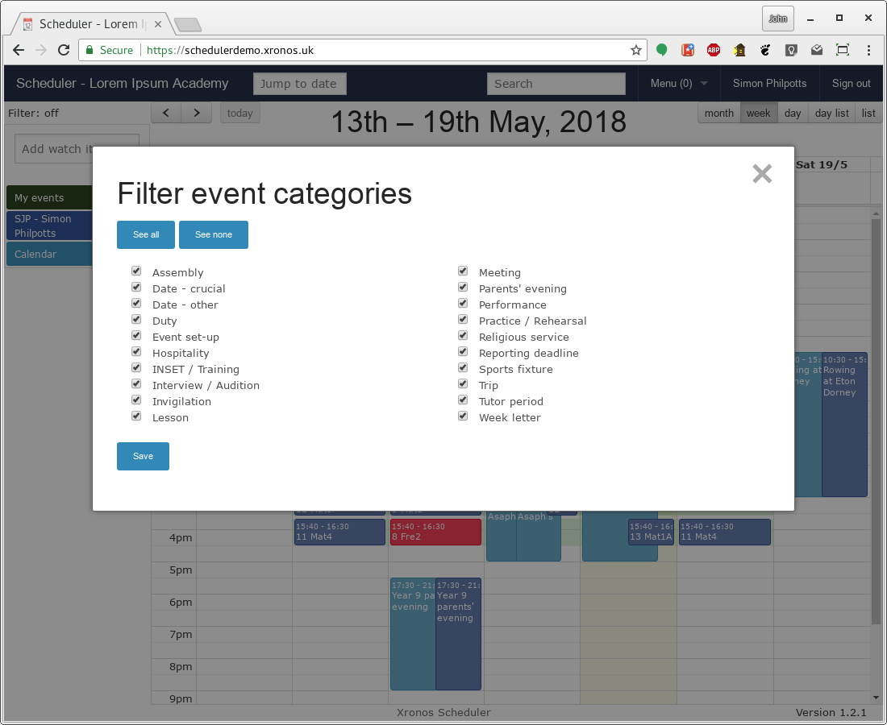
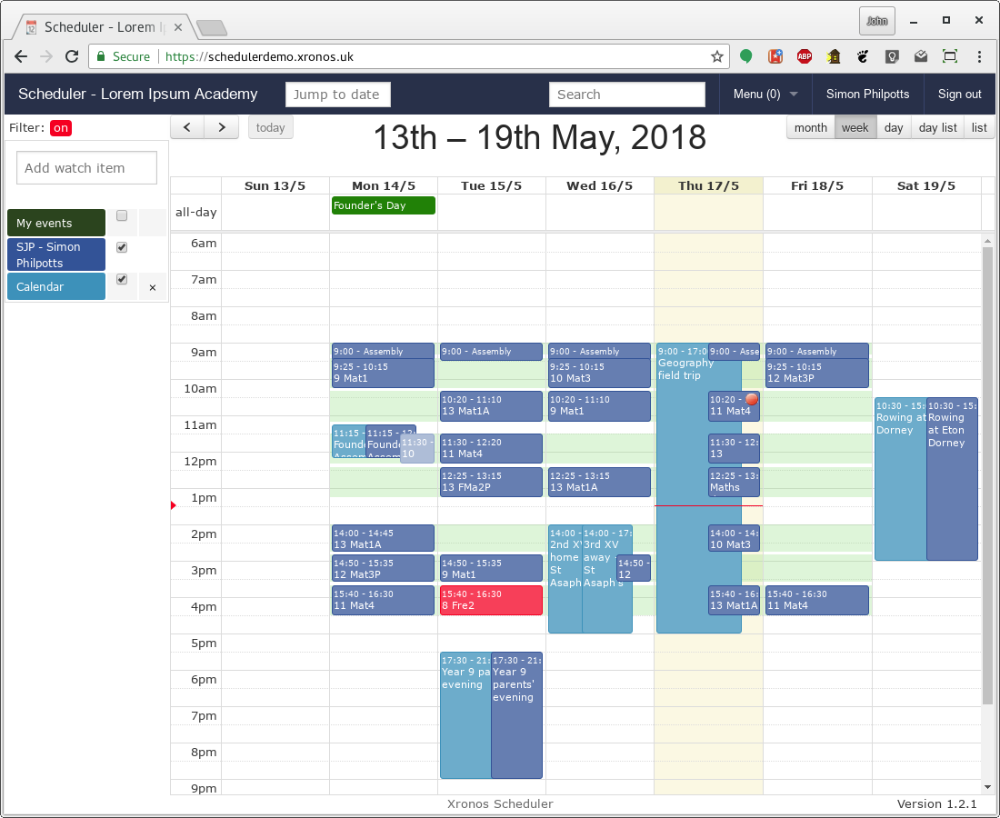

Event categories
================

Each time you create an event in Scheduler you allocate it to an
Event Category.  The idea of these is to give a broad idea of what
is happening at the event, but they also provide a degree of control
over how events will be treated within the system.

The exact set of event categories which exist within your system is
under the control of your system administrator, but the following are
the ones which are created by default.

There are three broad groups of event categories:

- Busy categories
- Non-busy categories
- Privileged categories

If a person or room is assigned to an event in a "Busy" category
then it becomes possible to identify potential clashes.  On the other
hand, an event in a "Non-busy" category does not imply that the
person or room is busy.

Privileged categories have special meanings, and normal users cannot
generally create events in privileged categories.

Busy categories
---------------

:Event set-up: For time before or after an event when the venue(s) are being
               prepared or cleared up.
:Hospitality: For events where guests are offered food and/or drink.
:INSET / Training: Self-explanatory.  Has no special significance other
                   than the name.
:Interview / Audition: Self-explanatory.  Has no special significance
                       other than the name.
:Lesson: Probably the most populous category of event, although not usually
         entered manually.  The lessons within your system will typically
         be imported automatically from your school's MIS.
:Meeting: Self-explanatory.  Has no special significance other than the name.
:Performance: Self-explanatory.  Has no special significance other than the
              name.
:Practice / Rehearsal: Self-explanatory.  Has no special significance other
                       than the name.
:Religious service: Self-explanatory.  Has no special significance other
                    than the name.
:Sports fixture: Self-explanatory.  Has no special significance other than
                 the name.
:Trip: Self-explanatory.  Has no special significance other than the name.

Non-busy categories
-------------------

:Date - other: A date which may be of interest to the attached people,
               but doesn't render them busy.  For instance, "Head of
               Department away" might be a useful event to enter, with
               all the members of the department added as resources.

Privileged event categories
---------------------------

:Assembly: Self-explanatory.  Has no special significance other than the name.
:Date - crucial: A key date in the life of the school.  Typically used
                 for things like the start and end of term.  Will show
                 through on all schedules.
:Duty: Used to record duty slots for individual members of staff.
:Hidden: Does not show up on any schedule.  Used for events which have
         an effect on the background processing within Scheduler - e.g.
         lesson suspensions.
:Invigilation: Used to record exam invigilation slots.  Events in this
               category are generated automatically by the exam
               invigilation tools within Scheduler.
:Parents' evening: Self-explanatory.  Has no special significance other
                   than the name.
:Reporting deadline: Self-explanatory.  Has no special significance other
                     than the name.
:Tutor period: Self-explanatory.  Has no special significance other than
               the name.
:Week letter: For schools which have a two week timetable, events in
              this category show which week is which.  They show through
              on schedules (unless filtered out) and affect the creation
              of repeating events.

Choosing
--------

When entering an event, it's quite important to choose an appropriate
event category.  The more accurate the information which is entered
into Scheduler, the more use it then is to everyone else.

In particular, be aware of the difference between "Busy" and "Non-busy"
categories.  A "Busy" category means that all the resources specified
for the event are tied up in that event.

Non-busy categories are particularly useful when you want to draw
the attention of staff to some sort of event, without them actually being
involved in the event.  For instance, if the head of the English department
is away for two days at an exam moderators meeting, it might be useful for
the rest of the department to know about it.  It's tempting to enter an event
in Event Category "Meeting", with all the English teachers attached to it.

This is wrong - what you would be telling Scheduler is that the entire
English department are in a two day meeting.  All sorts of clashes will
be flagged because presumably they would have lessons then too.

Instead, enter an event in the "Date - other" category, with all of
the English teachers attached.  It's a signficant date for them, but
no more.

More non-busy categories can be created by your system administrator.
An obvious potential one is "Prep" or "Homework".  This can be used to
enter all-day events for particular pupils showing what prep or homework
they should have/be doing on that day.  The existence of such an event
does not mean that the pupil will be busy (and thus absent from lessons)
on that day - it's merely documenting something which happens on the day.

Filtering
---------

The primary way of filtering events in Scheduler's display is by the
resources involved in them.  However, you can also filter by Event
Category.

In the main Scheduler display, click on the words "Filter: off" at the
top of the left hand column and a dialogue box will appear.

Here you can choose which event categories you want to appear on your
screen.  If you un-tick any of the boxes, then all events in that
category will disappear from your display.  If you untick them all,
then you'll see nothing.

To avoid confusion - not being able to find events which should be there -
the display changes slightly when you have any filtering active.

To restore the normal display, just invoke the dialogue again.
