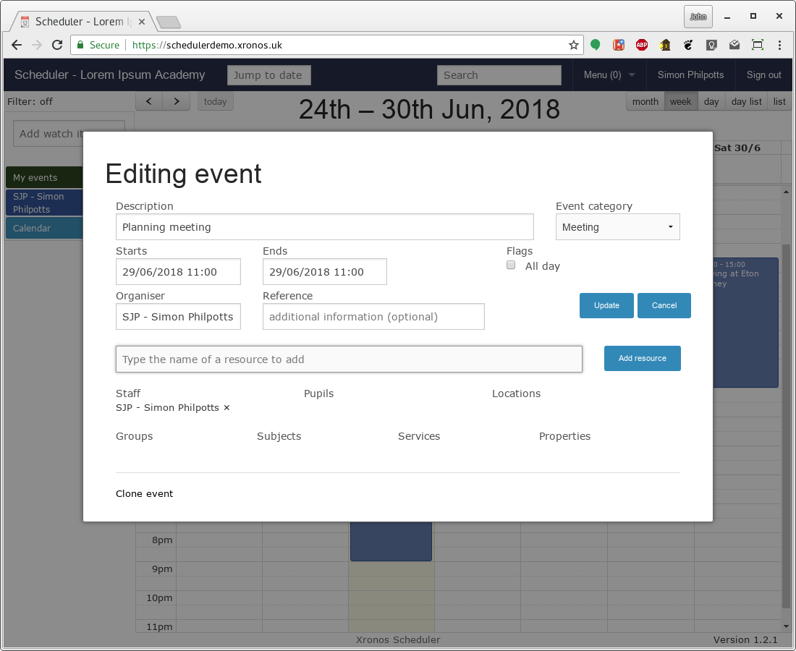
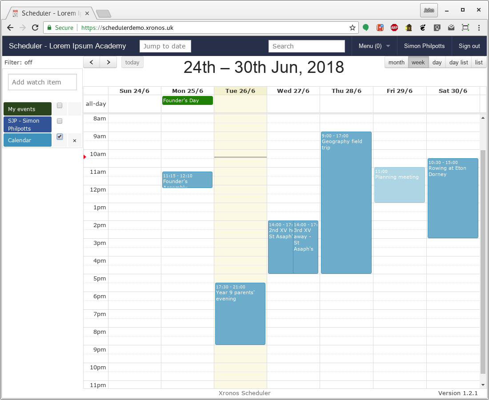

Entering events
===============

You enter events into Scheduler in much the same way as you would
for any calendaring program, but with one big difference - they
are structured.  Each event carries information about the resources -
people, places and services - involved in it.

.. warning::

   The most common source of confusion for a new user is entering
   an event without any resources and then wondering why no-one
   else can see it.  Such an event is visible only to the person
   who put it in - and only then if "My events" is ticked.

   Scheduler is interested in the *resources* which each event uses.
   An event with no resources might as well not be there.

--------
Creating
--------

To create a new event in the system, simply click on the relevant date
and time, or click and drag to set both a start and an end time.  All-day
events can be entered by clicking in the all-day section at the top of
each day.  A dialogue box will appear as shown below.

The first box is simply for you to put in some sort of description
of your event.  E.g. "Planning meeting for trip to Greece".

.. warning::

   Again, a common mistake is to try to put unnecessary information
   in this box.  Don't put "Planning meeting for trip to Greece - room
   6H", or "Progress meeting - Lord Copper, Jane Ayre and Harriet Vane".

   Instead put "Planning meeting for trip to Greece", and "Progress meeting"
   and then add the venues and/or attendees as resources in the next
   step.  To get the full benefit of Scheduler you need to give it
   accurate structured information.

The next box lets you put your event into one of a number of broad
categories.  What exactly is available in your system will depend on
how your system administrator has configured it, but these are what
are on the demonstration system.

.. image:: enterevent2.png
   :scale: 75%
   :align: center

Because I just clicked on the calendar to create this event, the
start and end times are the same.  You can change them either
here in the dialogue, or by dragging the event on screen later.

The Organiser field provides documentary information about who is
responsible for the event.  Sometimes the actual data entry is done by
a different person, and it can be useful to know who the right
contact is.  Finally, the Reference field allows extra text to be
entered if needed.

----------------
Adding resources
----------------

Once you click on the Create button, the dialogue changes slightly -
a new field appears at the bottom.  The event now exists, and resources
can be assigned to it.

Note that there is only a single field for adding resources.  You
can type there the name of any resource - staff member, pupil, room,
location, service, property or group - and the system will assist
you by auto-completing it.  As you add resources, they are sorted into
their various types and listed as being involved with the event.

.. note::
   Try to include all the resources which your event will require.  List
   the staff who will be there.  If you want a group of pupils, you can
   either use a pre-existing group or create one of your own and add
   that.  If you're using a particular room, add that in.  If you need
   a particular service like cleaning or catering, list those too.  The
   whole idea is to share as much information as possible.

Obviously there are some kinds of resources which need a degree of
control.  You can't have just anybody putting events into the school's
public calendar.  Note what has happened here when Simon Philpotts
attempted to add "Calendar" as a property to his event.

It has appeared, but it's highlighted in orange.  This indicates that
approval is needed before the event will actually appear in the
school calendar.  The relevant people will have been notified, and
once the event has been approved it will then appear.  For now, only
Simon Philpotts will be able to see it in the context of the Calendar.

To finish off editing the event, click on the Update button and you
will be taken to a dialogue showing full details of the event.

Notice that it's there, but greyed out to indicate that it's incomplete.

-------
Editing
-------

You can edit any event which you have created, plus your system
administrator may give you permission to edit others.  To edit an
existing event, simply click on it and you'll get shown additional
information about the event.  Provided you have the appropriate
permissions there will also be an "Edit" link on the left hand side.

---------
Adjusting
---------

Remember that this event originally had no explicit end time?  Now the
bottom edge of the box can be dragged up and down to set a duration.

You can also drag the whole box to a different time, or a different day.
To make it an all-day event, drag it up into the "all-day" section at
the top of the day's column.

.. note::
   If you want to move an event from one day to another whilst
   retaining the same timing it can be helpful to do it from the
   "Month" view of the schedule.  That way you can see more days,
   and now matter how you drag, the times of the event won't change.

If you want to set up an event for a specific resource, you can short-cut
the process by dragging the required resource from the left-hand column
into the calendar at the required time.  The same dialogue box will
display, but then the indicated resource will be added to the event as
soon as it is created.

