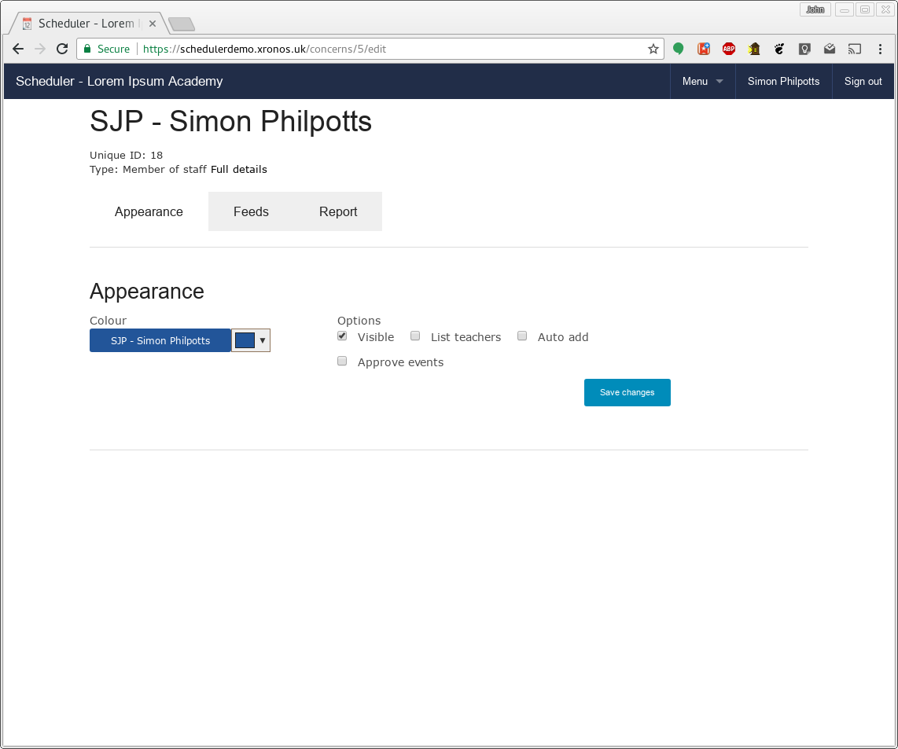
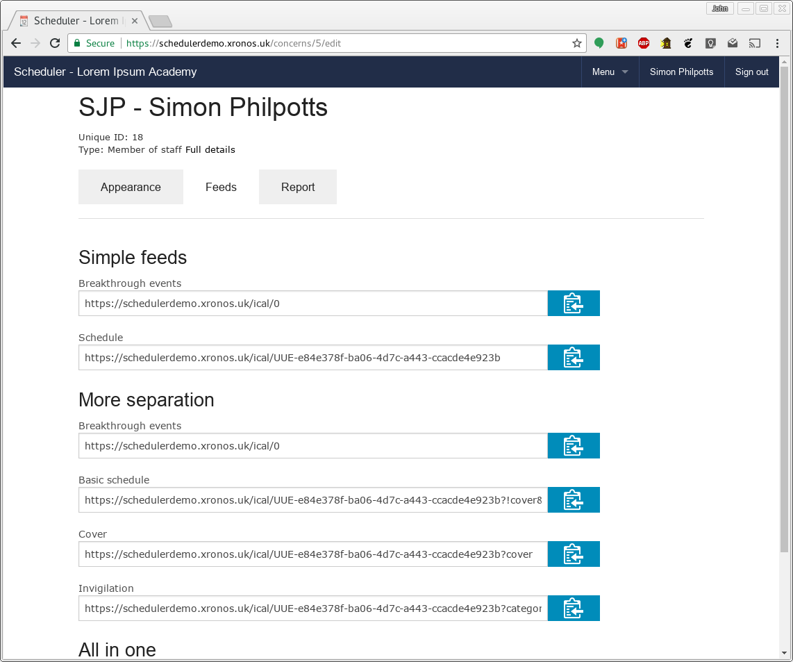
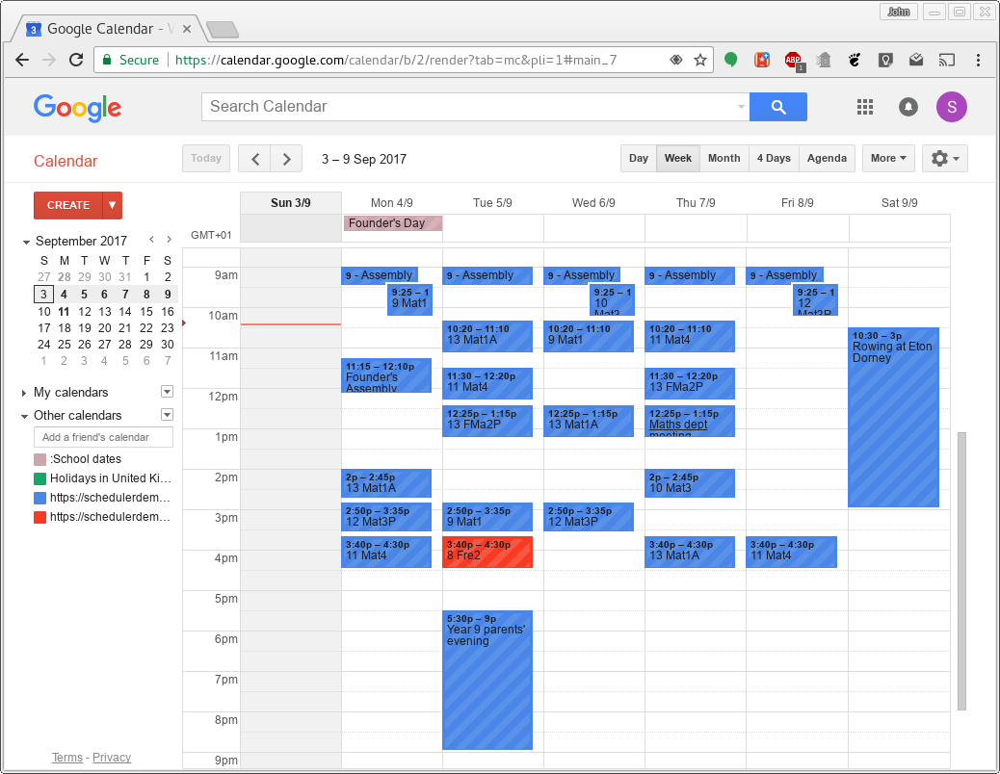

Calendar feeds
==============

All the information held within Scheduler can be viewed directly
within the program, but it can also be convenient for users to
see the information relevant them in their external calendars, or
on their mobile devices.

Scheduler provides highly configurable calendar feeds, which are
compatible with pretty much any calendaring program.  It can provide
a feed of events relevant to any resource which it knows about - whether
a real resource like a member of staff, pupil or room, or a virtual resource
like the school's public calendar, or its sports fixtures.

------
Set up
------

Calendar feeds are specified by means of a Uniform Resource Locator
or URL.  Scheduler will construct the necessary URLs for you automatically.
You then pass the URL to your calendaring program of choice (usually by
copying it to your clipboard and pasting it into that program) and
it will then fetch the desired events directly from Scheduler.

Logged in to the Scheduler demo system, click on Simon Philpotts's name
on the left hand side to see a screen like this:

Notice that there are three tabs on this screen - Appearance, Feeds and Report.
Click on the Feeds tab, to get a screen like this:

There are various pre-constructed URLs here.  The first two are the
simplest to use.  Of these, the first will give a feed of breakthrough
events, not specific to Simon Philpotts himself, but relevant to the
whole school.  Typically they will be term dates, week letters etc.

The second URL is for the whole of Simon Philpotts's schedule in one go -
his timetable, plus all the other events in which he is explicitly
involved.  Click on the icon to the right of it to copy it to your
clipboard, and then paste it into your calendar program of choice.  After
a short delay, all the events relevant to SJP will appear in your
calendar program.

How often they are refreshed depends on your calendaring program, but
typically Google Calendar seems to refresh them about every 24 hours.

You can take a feed like this for any resource in the system, not just
your own teacher/pupil record.  Thus you might for instance take a feed
of all the lessons in your normal teaching room, so you can tell when
it's in use by other people.

-----------
More detail
-----------

If you'd like to get things broken down further, go for the URLs in
the next section of the page.  The first one (for breakthrough events)
is the same as before, but the other two will separate out cover
and invigilation events and provide them in separate feeds.  You can
thus choose to display them in different colours in your external
calendaring program.

The end result in Google Calendar can look like this:

If you then synchronize your portable device with your Google Calendar,
you have your timetable always to hand - and up to date!

------------------
Additional options
------------------

You may have noticed that the constructed URLs above use various options
to achieve the desired results.  

.. note::
   Options are added to URLs by putting a question mark (?) before
   the first option, and then if there's more than one option, separating
   them with ampersand (&) characters.

   https://schedulerdemo.xronos.uk/ical/0?able&baker

   has two options specified - able and baker.

You can add further options to the URLs given above to tweak the end result.

- start_date=YYYY-MM-DD

  Specify the start date for the events to be returned in the feed.  Without
  this option the feed will go back to the start of the previous era
  configured within the system.  Typically this means the start of the
  previous academic year.

- end_date=YYYY-MM-DD

  Likewise, specify an end date for the events to be returned.
  Without it, the feed will use no end date - any future events within
  the system will be returned.

  All dates should be given in ISO format - e.g. 2017-09-01

- past_days=N

  As an alternative to specifying a particular date, you can say
  how many days into the past you want the selection of events to
  go.  A value of 0 indicates no past days, so selection will start
  on today's date.

  If both a start_date and a number of past_days are specified, the
  start_date takes precedence.

- future_days=N

  Likewise, you can specify how many days into the future you want
  event selection to cover.  A value of 0 means stop with today's
  date.  If you set both past_days and future_days to 0 then you
  will get event for today's date only.

  If both an end_date and a number of future_days are specified, the
  end_date takes precedence.

- cover

  If specified, only events assigned specifically as cover will be returned
  in the feed.  This is to allow the end user to make them appear in a
  different colour in the client calendar system.

- !cover

  And this one specifies that everything else *except* cover is wanted.

- categories=able,baker

  Passes a comma-separated list of event categories to limit the events
  which will be returned.  Only events within those categories will be
  returned.

  The exact list of categories will depend on how your system administrator
  has set up your system, but you can see them by going into the event
  creation dialogue and looking at the pop-down list there.

- everything

  Merges the breakthrough events into the specified resource's schedule.

- spread=NN

  For some feeds, it may be desired to list only some of the locations
  used by an event.  For instance, a play may involve the school theatre,
  plus a number of ancillary rooms, but for the public calendar only
  the theatre itself should be mentioned.

  Rooms within Scheduler can be given a weighting and if this option is
  specified then for each event only the room with the maximum weighting,
  plus any others within the specified spread will be included in the feed.

  It is thus possible to filter out the ancillary rooms and show the play
  as happening just in the theatre.

- clip

  Some calendar programs fail to handle end dates/datetimes correctly.
  The ical specification defines these as being *exclusive* - that is,
  the end date/datetime given is not part of the event.  Thus for
  an all-day event running from the 1st to the 3rd, the end date is
  the 4th.  Likewise, for an event running from 10:00 - 11:00, the end
  time is 11:00, but 11:00 is not part of the event.  If another event
  runs from 11:00 - 12:00, they do not overlap.

  This option tells the ical generator to chop one minute off the
  end time of timed events with non-zero duration which end at exactly
  midnight.  Thus an event on 2020-02-01 from 17:00 to midnight
  should have an end time of 2020-02-02 00:00:00, but instead the
  generator will adjust it to 2020-02-01 23:59:59.

  This is contrary to the specification and is provided solely to help
  with broken client programs.  Ideally, fix your client program and
  stop using this option.

.. warning::

  Scheduler caches the result of any calendar feed request for 1 hour.
  Any additional request for exactly the same feed within that hour
  will get the same data as the last time, even if something has changed.

  If you use the past_days and future_days options above, this can mean
  that you don't see quite the data which you're expecting if you
  make a request between 00:00 and 01:00 (and you also requested the
  same data just before midnight).

