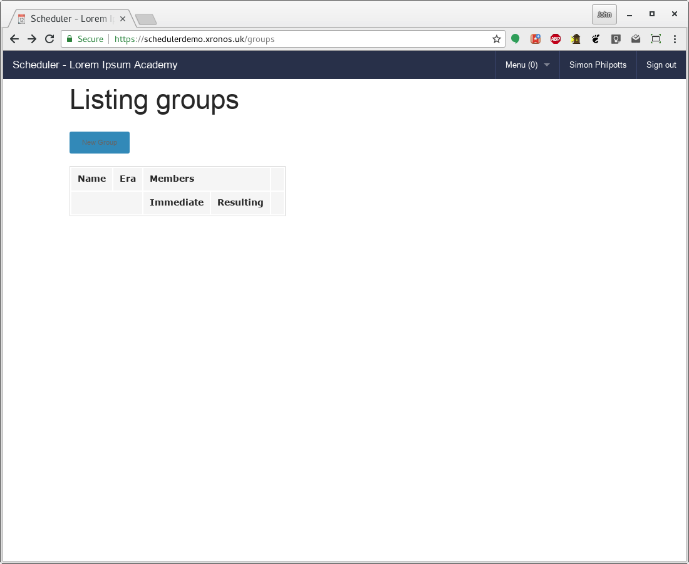
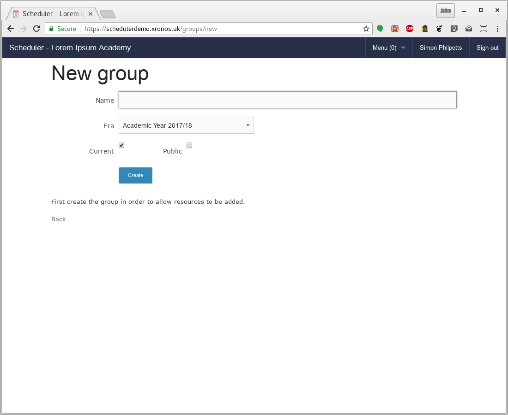
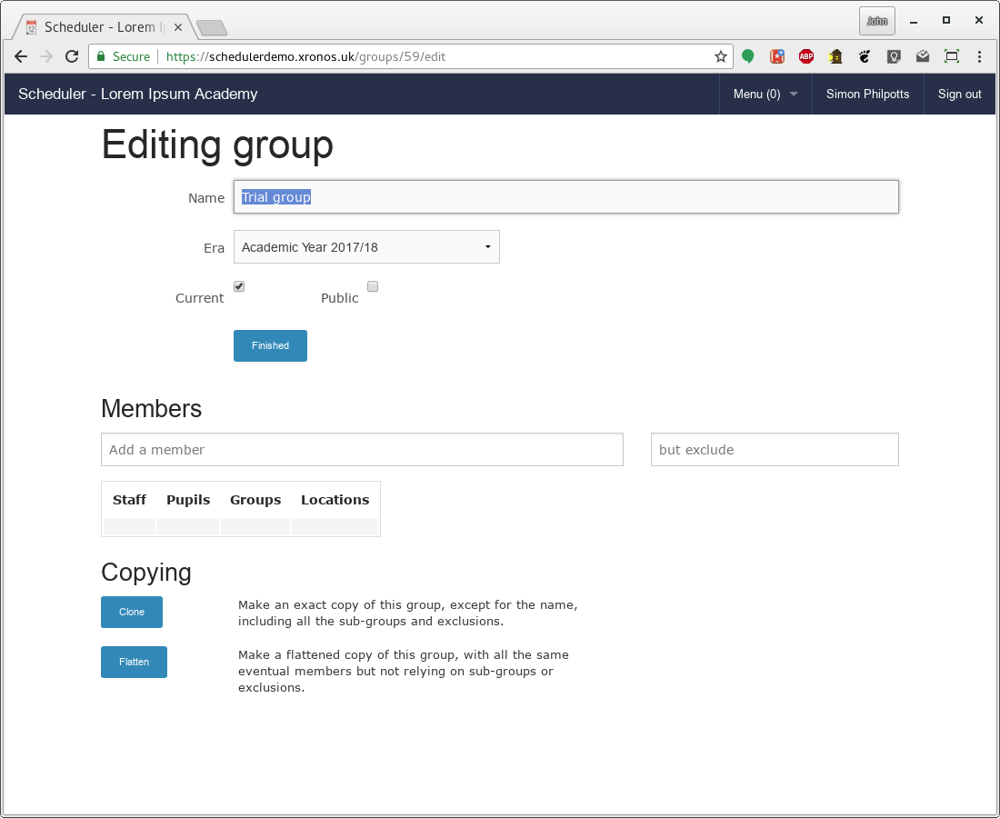
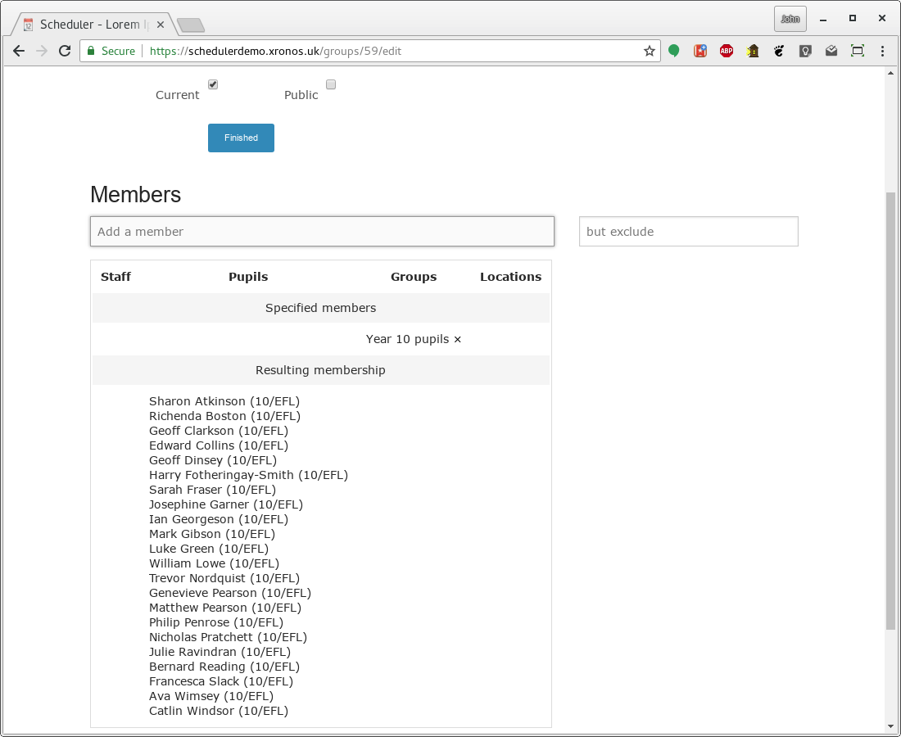
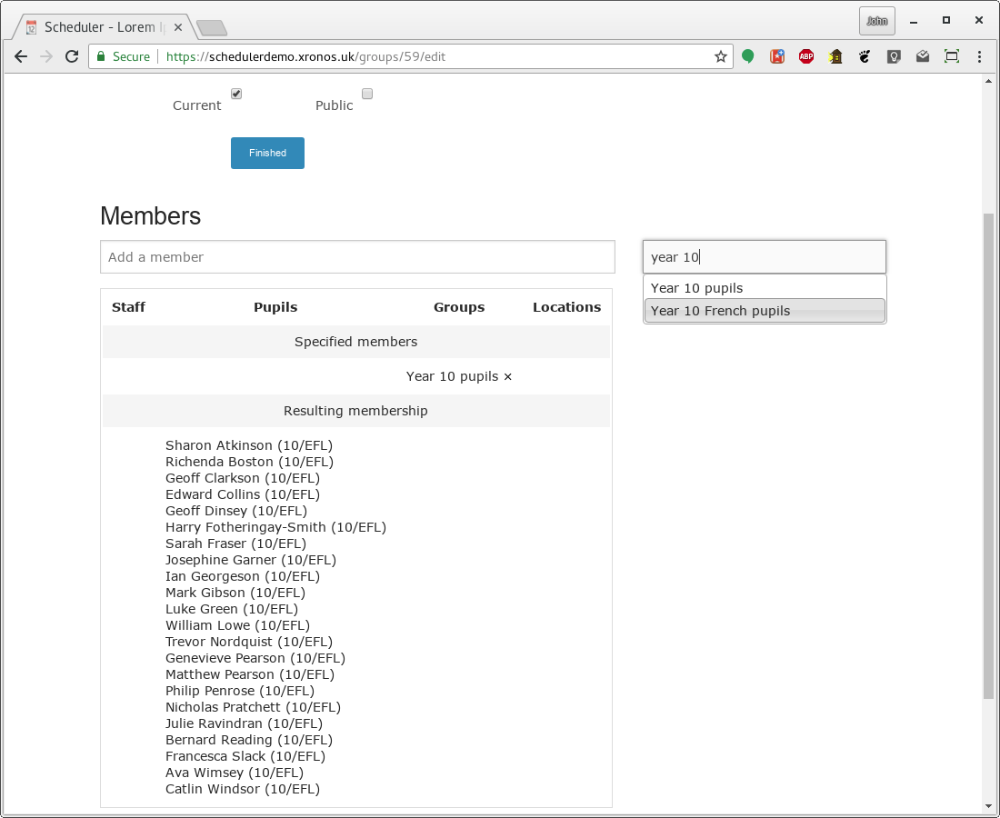
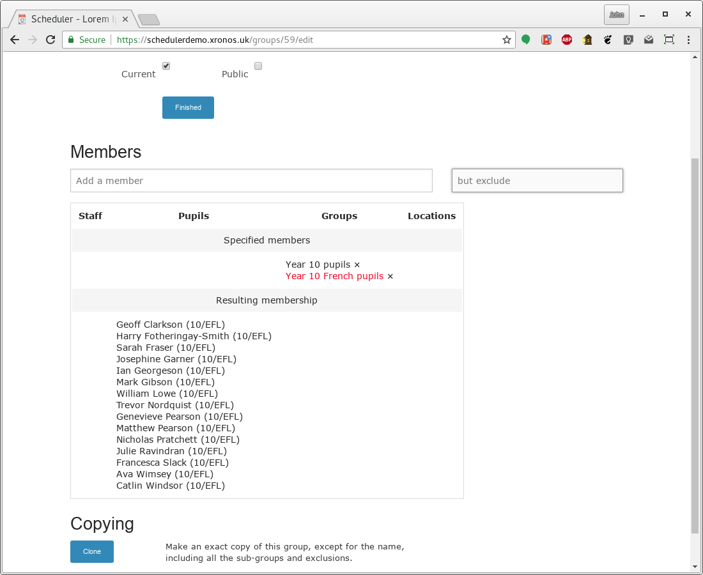

Groups
======

======
Basics
======

One of the most powerful features of Scheduler is its support for
grouping things together.  Any of the other entities which
it handles can be placed in a group and then these groups can
be attached to events.

A group can contain:

* Staff
* Pupils
* Locations (rooms)
* Services
* Properties
* Subjects

and last, but by no means least:

* Groups

Groups can also have members excluded from them - e.g. all the sixth
form except prefects.

All the groups within Scheduler are implemented using the same
underlying code and have all the same functionality.  There are
a few specialist groups (Teaching Groups, Tutor Groups) which have
added features, but the underlying group code is identical.  The
specialist groups are effectively sub-classed from the fundamental
Group implementation.

==========
Chronology
==========

A major feature of Scheduler's implementation of groups is that it
understands that the membership of groups varies over time.  Pupils
join and leave sets; membership of teams changes; the list of people
going on a trip has additions and cancellations.

Scheduler stores the whole history of the membership of a group.  It
can show you not just who (or what) is in the group today, but who was
in the group last Thursday, who was in it on the first day of term,
and even who was in it last year (if the group existed last year).

When groups are used to display the schedule of an individual (and
for pupils in particular, groups are absolutely essential to the
calculation of their schedules) the schedule will be correct according
to the individual's group membership on each particular day.  If a pupil
is added to a football team on a Wednesday, then said the team's match
on the coming Saturday will appear on the pupil's schedule, but not
the match for previous Saturday.  Likewise (but the other way around)
for the pupil who is removed from the team on the Wednesday.

====
Eras
====

Scheduler has the concept of eras - periods of time which
group things together.  For schools, these are naturally the academic
years - usually from one September to the following August.

At any given moment, there is one current era - the current academic
year - configured in the system, plus a previous era and a next era.  There
is also a perpetual era - one which goes on forever.

Each time a group is created, it gets assigned to an era.  Usually it's
a choice between the current era and the perpetual era.  Which of these
is best depends on the characteristics of the group being created.

A group like 9MAT1 - year 9, maths, set 1 - is liable to exist in
every academic year, but the 9MAT1 from one year bears no relation to
the group of the same name from the previous academic year.  When a teacher
goes looking for 9MAT1 they tend to want this year's one - not last
year's or the year before's.  Hence, it makes sense to attach 9MAT1
(and indeed, all the teaching sets) to the current academic year - the
current era.  Groups attached to the current era naturally come to an
end at the end of that era - although they aren't deleted from the system
and all their information can still be retrieved.

On the other hand, a group like "Geography teachers" has continuity
from year to year.  There will be changes from year to year, and
even during the course of a year, but the meaning of the group stays
the same and much of the membership will flow on from year to year. [1]_
This group therefore naturally fits in the perpetual era.

.. note::

   Assuming your school has geography as a subject, that last group
   will be created and maintained automatically as part of the
   process of importing data from your MIS.  Any teacher who takes
   at least one geography lesson will be in that group, and it
   will be attached to the perpetual era.  It's mentioned here just
   as a good example of a group which should go in the perpetual era.

====================
Groups from your MIS
====================

Scheduler is designed to avoid double entry of data, and will import
all the groups which it can from your existing MIS.  Typically these
will be:

* Teaching groups
* Form or tutor groups
* House groups
* Ad hoc groups

The naming of these last ones varies from MIS to MIS, but they're groups
created as needed by indivual teachers - for example, the list of pupils
going on a trip.  These can be particularly useful, because you can
create the list in your MIS - probably needed in order to fill out
the necessary H&S forms for the trip - and then it will migrate over
automatically into Scheduler, where you can attach the group to your
event.  Scheduler will then flag all the affected lessons, listing exactly
who is going to miss which lesson.

================
Automatic groups
================

As part of the import from your MIS, Scheduler will also create a lot
of automatic groups.  These are:

* All pupils
* All staff
* All teaching staff
* Pupils by year group
* Pupils by house
* Pupils by house and year group
* Staff by subjects taught
* Staff by subjects taught and year group
* Staff by year groups taught
* Pupils by subjects studied
* Pupils by year and subjects studied

More can be added specific to your school.

=============
Manual groups
=============

Provided your system administrator has given you the necessary permissions
(and by default, all teaching staff have this permission) you can
create and maintain your own groups within Scheduler.  You can also choose
whether to make them visible to other users of the system.

Thus, the person responsible for prefects within the school might create
a group called "Prefects", populate it with all the relevant students and
then make it generally visible.  It would probably want to be attached
to the current era, because the list of prefects usually changes entirely
at the end of the year.

Similarly, it might make sense to create a group called "Senior Leadership"
and populate it with all the relevant staff.  Again, this would tend to
be a publicly visible group, but it would go in the perpetual era.

==============
Editing groups
==============

To edit groups, use the menu in the top bar and choose Menu => Groups.
You may find you already have groups listed if you have created any
in your MIS, but otherwise you'll get an empty screen like this:

Click on the "New Group" button and you'll see a screen like this:

Give it a name, and choose which era you want it to go into.  You
will generally want to leave the "Current" box ticked, and you can
decide whether to tick the "Public" box.  If you do, then other people
will be able to use your group for their events, or for building other
groups.  If you don't make it public, then it will still have public
effects (make events appear in individuals' schedules) but it won't
be available for others to use.

Before you can add members to the group, it needs to exist, so click
the "Create" button and your screen will change to this:

You now have two additional fields, in which you can enter the names
of things which you want to add to the group.  All types of things
go in the same fields, and Scheduler will sort them as you add them.

Let's say I want to populate my group with all the year 10 students
who don't study French.  I can do this by using existing automatic
groups.  First I add "Year 10 pupils" to my group.

Note that Scheduler shows what I've added, and what the resulting
membership will be.

.. note::

  For those panicking about the GDPR, all these names are fictional
  and generated automatically in the
  `Scheduler demonstration system <https://schedulerdemo.xronos.uk/>`_
  .  They change every night.  If you log on and try to do the same,
  you'll see a different set of names.

Now I want to exclude the pupils who study French, so I type "Year 10
French pupils" in the right hand box (for exclusions):

and I end up with this:

Note that the excluded group has been added in red (to show it's an
exclusion) and the resulting list of pupils has got shorter.

.. note::

  The system will even cope with a double negative.  Starting from
  a group called, for instance, "Prefects", you can create a second
  group called "Prefects except William Wilberforce", consisting
  of "Prefects" but with an exclusion for William Wilberforce.  You
  can then go on and create a third group specified as being all of
  the upper sixth, except "Prefects except William Wilberforce",
  and you'll end up with a group consisting of everyone in the upper
  sixth who isn't a prefect, plus William Wilberforce.

  *And* it will do all this over whatever chronology you choose, **And**
  it will do it in real time as your events are displayed.  Pretty
  good for something written entirely in an interpreted programming
  language - Ruby.

Finally, the two buttons at the bottom of the edit dialogue allow
you to clone a group (create a new identical group with a different
name, complete with all the nested structure) or flatten a group
(create a new group with the same eventual membership, but losing
all the nesting).  The latter can be quite useful if you want to freeze
the membership of your group.  You might create it using as building
blocks groups provided by other people, but having got the list you want
you might not want it to change when the other groups change.

.. [1]
  They're like rats - no matter what you do you can
  never eradicate them entirely.

