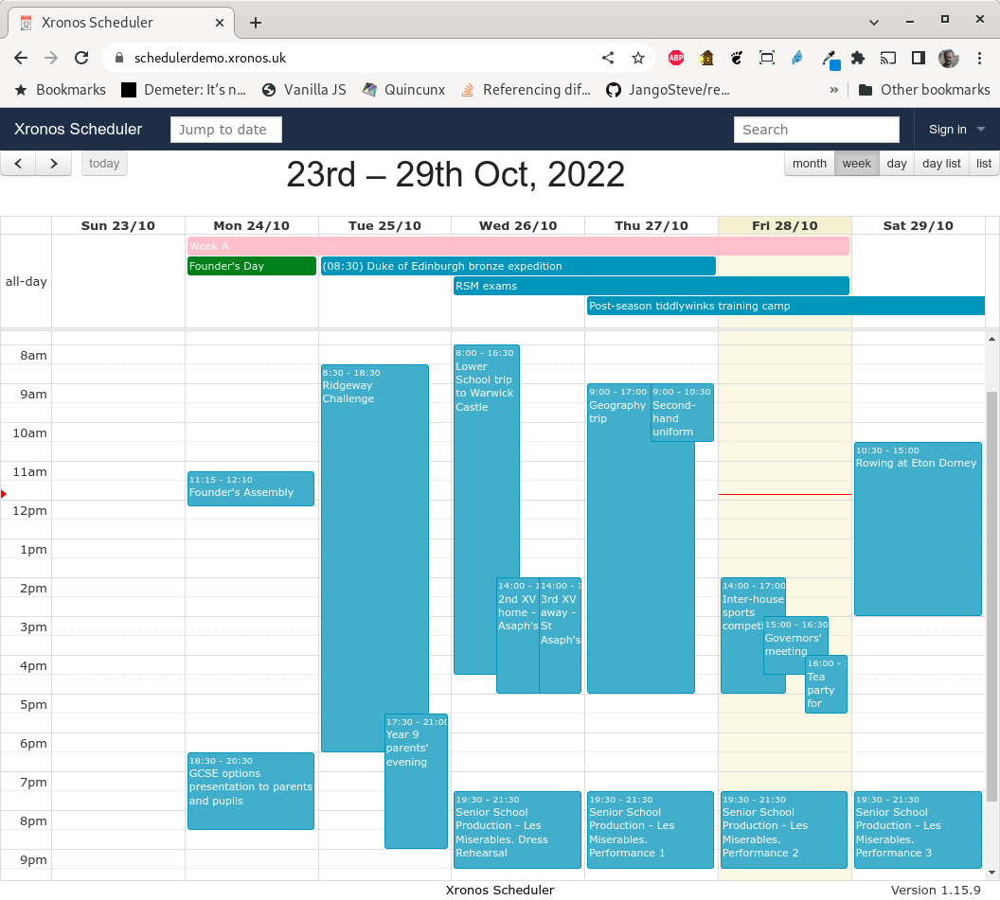

.. Xronos Scheduler documentation master file, created by
   sphinx-quickstart on Thu Nov 17 11:45:33 2016.
   You can adapt this file completely to your liking, but it should at least
   contain the root `toctree` directive.

Index
=====

Xronos Scheduler - a scheduling program for schools.

Find the source on
`GitHub <https://github.com/XronosSchedulingLtd/scheduler>`_.

.. toctree::

   overview
   background
   quicktour
   concepts
   tweaking
   feeds
   events
   repeating
   relocate
   reports
   invigilation
   contact
   credits

Other documents
---------------

- `Scheduler Installation Guide <https://xronos.uk/install/>`_

Scheduler is licensed under the GNU General Public Licence, version 2.

Note - Scheduler is *not* a timetabling program.  It has no facilities
at all to solve the problem of school timetabling.  If you want a good
timetabling program, try `Keith Johnson's Timetabler <http://www.timetabler.com>`_.

Indices and tables
==================

* :ref:`search`

