Exam invigilation
=================

---------
Overview
---------

Some School Management Information Systems are better than others at
handling the entry and maintenance of exam invigilation slots.  If
your MIS has the facility to handle these then Scheduler will import
and display them, but if not then you can do it directly with Scheduler.

Scheduler will assist you with setting up the framework of slots, scheduling
when the actual exams are, and selecting the most suitable staff to use
for each individual slot, taking into account suspended lessons
and how many slots each staff member has already done.

-----
Steps
-----

The whole job can be broken down into a number of distinct steps:

* Choose which staff can do invigilation
* Record the times of the invigilation slots
* Record the days on which the exams will occur
* Record which rooms are to be used
* Generate the event records
* Allocate the right number of staff for each location and time
* Notification

A system administrator can nominate one or more users to act as exams
officers.  Once this is done, any of them can do any of the following
steps.

---------------------
Group of invigilators
---------------------

It's probable that your school will have a specific list of people
who are eligible to invigilate exams.  This may well be very similar
to your list of teaching staff, with the odd addition or removal.

Scheduler's standard group handling facilities can assist you in
assembling a suitable list.

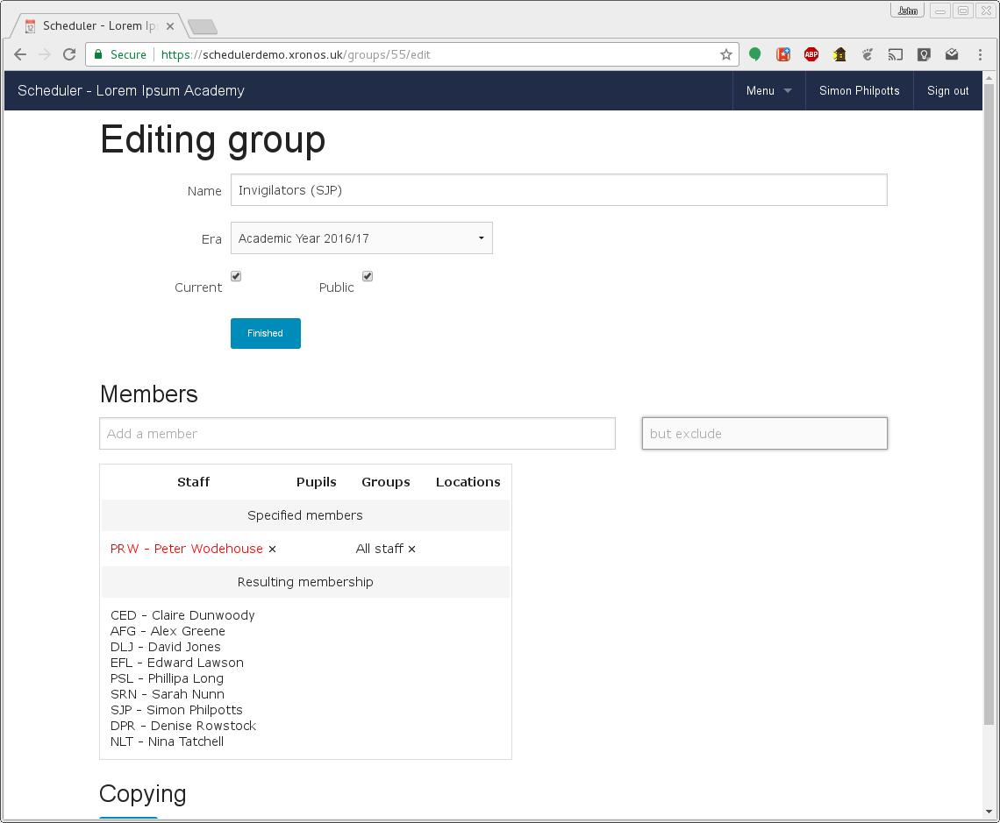

In the above screen, a group has been created called "Invigilators (SJP)"
and it has been specified as including all staff, except Peter Wodehouse
who doesn't do invigilation.

By basing the group on another group like this, you can make sure it
updates dynamically as staff arrive or leave.

You are strongly advised *not* to use an existing system group directly
in the exam cycle to provide your invigilators - you will almost certainly
find later that you want to add or remove someone.

By creating your own group based
on a system group as shown here, you gain much more flexibility.

---------------
Timing of slots
---------------

Your school will have its own idea of how long an invigilation slot
should last and when they will be.  Quite likely this will reflect your
school's normal timetable.  You can enter this information as an
Exam Template.  From the menu icon in the top bar, choose
Menu => Invigilation => Template, and then click on the "New Rota template"
button.  Enter a name for it (e.g. "Internal examinations") and 
click on "Create".

You will then see a screen like this:

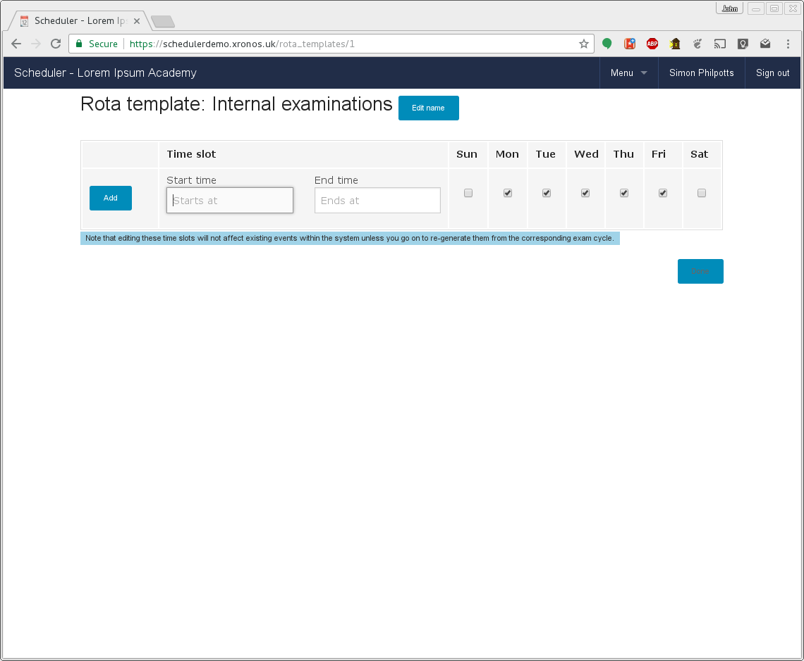

Enter start times and end times for each of your sessions, clicking
Add after each one.  Note that you can set up different time slots
for different days of the week if you want to.

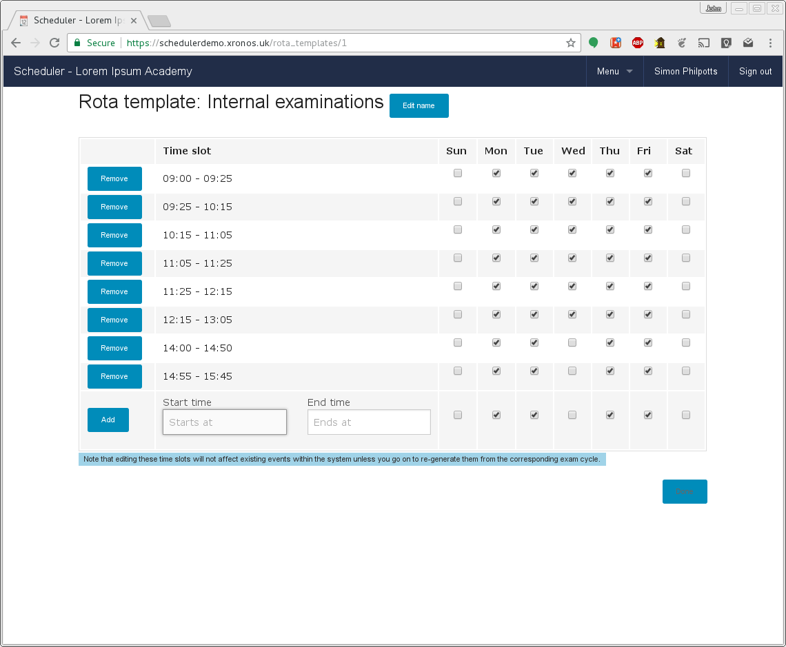

In the above screen, we don't have any slots on Wednesday afternoons.

You can add or remove the slots until you have the correct configuration,
then click on "Done".

You may want to set up more than one template to reflect the different
ways in which you organise different exam sessions.  For instance, one
might have exam slots all day, whilst another had them only in the
morning, or only on certain days of the week.  You can create as many
templates as you need to reflect your own particular organisation.

Templates can be used for just a single exam session, or re-used over
many if your timing requirements stay the same.

-----------
Exam cycles
-----------

An exam cycle represents an actual period of exams.  Typical examples
would be "4th year exams" or "Public exams, summer 2017".

To set one up, the exams officer should choose Menu => Invigilation => Cycles,
and then click on the "New Exam Cycle" button.

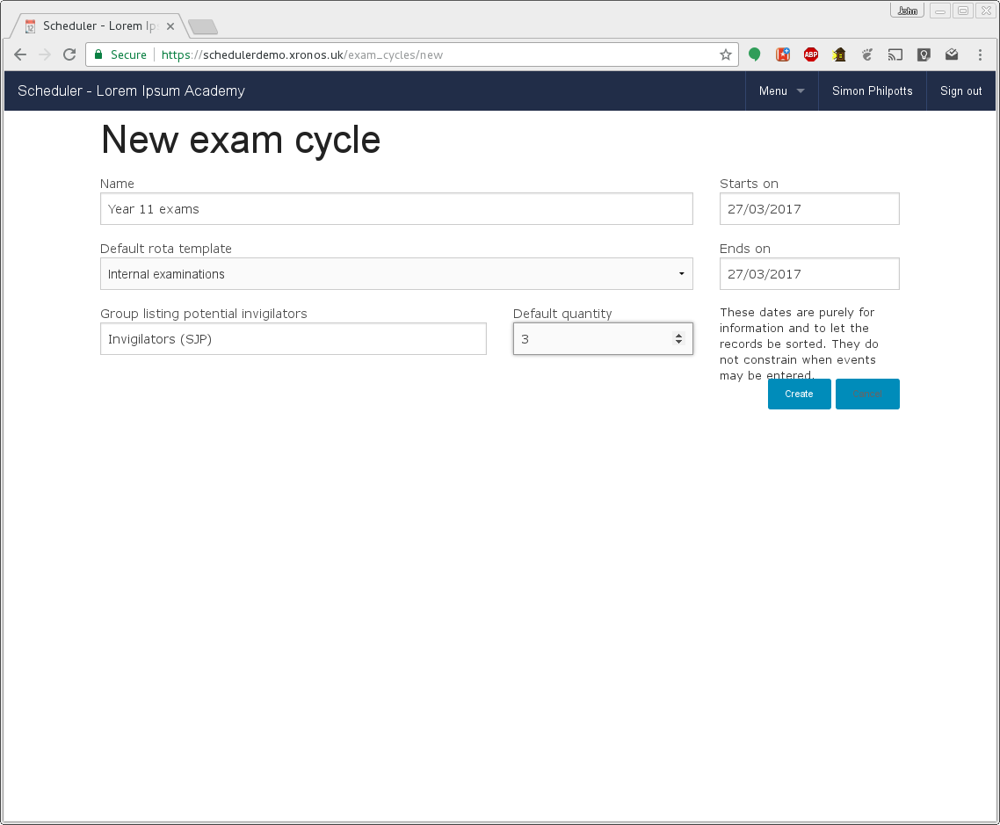

In the above screen shot, all the necessary fields have been filled in.
The first field is a simple name for the cycle, then below it the
template to be used.  On the right we have the duration of the cycle
(just 1 day for this demonstration) and finally the name of the group
to be used to provide invigilators, and the default number to expect
for each room.  Clicking the "Create" button will the cause the
exam cycle to be created.

------------
Rooms to use
------------

Next we need to define which rooms will be used.  In this case we're
going to use the Main Hall, and the Genghis Khan Suite.

Under "Rooms used" in the exam cycle listing, click on "Edit".  This
will give you the following screen.

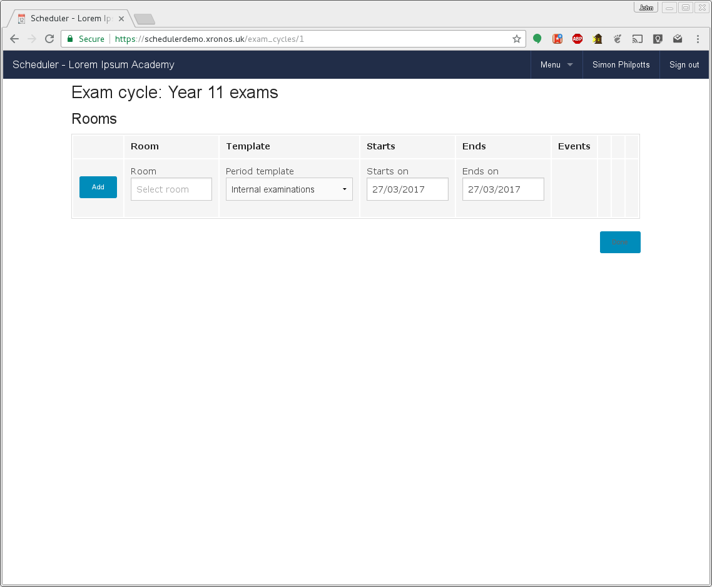

Type in the name of a room (the usual predictive text will appear) and
then click Add.  Note that each room can have its own individual template
and dates, but these default to being the same as those defined for
the exam cycle.

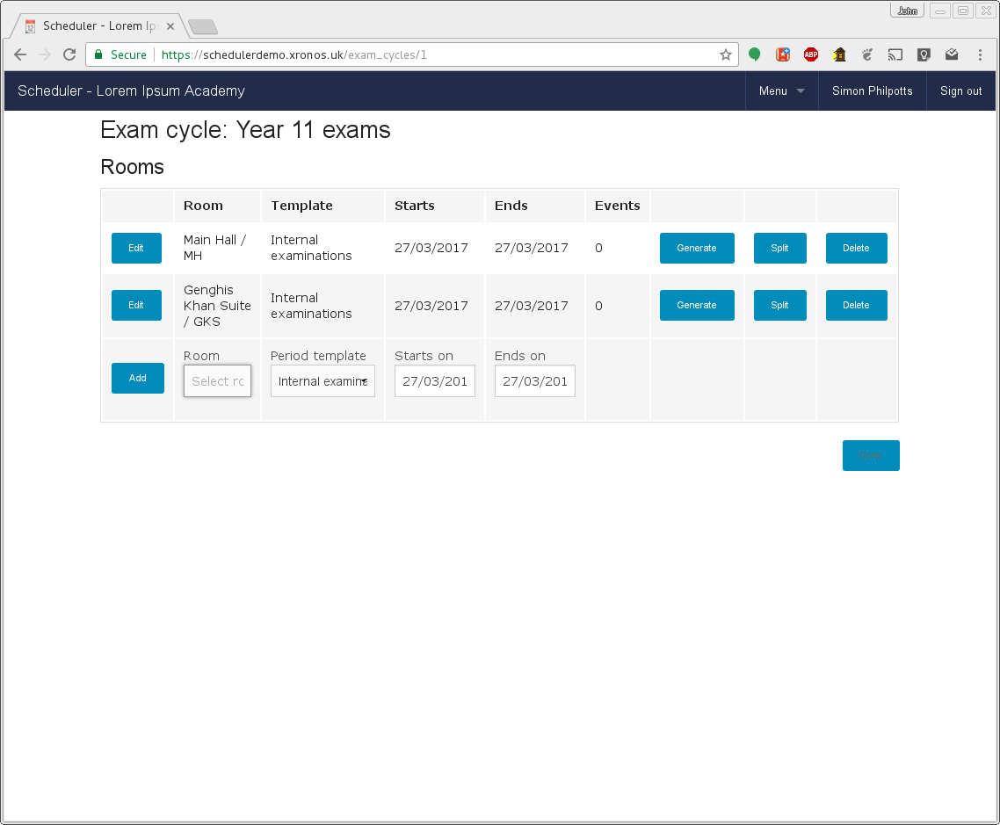

We now have the rooms defined, but currently no events.  To create the
actual invigilation events, click on the "Generate" button for each
room in turn.

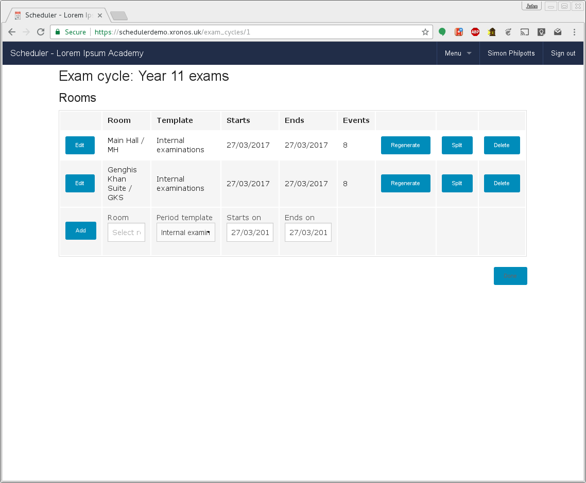

Note that the number of events in each room has now appeared, and the
"Generate" button has changed into a "Regenerate" button.

As far as possible, a "Regenerate" is non-destructive.  If you haven't
changed anything then nothing will be lost.  However, if you have deleted a
slot from the template then the corresponding slot (and all the invigilators)
will be deleted from your exam cycle.

.. warning::
   If you edit the exam cycle record, change it to use a different
   template and then click "Regenerate", all your existing events
   will go and be replaced with new ones, even if the two templates
   share some common time slots.

Re-generation can be very useful if, for instance, you want to add an
extra slot, or perhaps move a whole cycle of exams from one room to
another.  Just edit the corresponding line on this screen, change the
room to the new required location, and then hit "Regenerate".  All your
existing events, along with any allocated invigilators, will be moved
to the new room.

----------------
Staff allocation
----------------

If we now return to the normal calendar display (click on the School's
name at the left in the top bar) and choose to look at "Invigilation"
entries we see all the slots which we have requested in the two rooms.

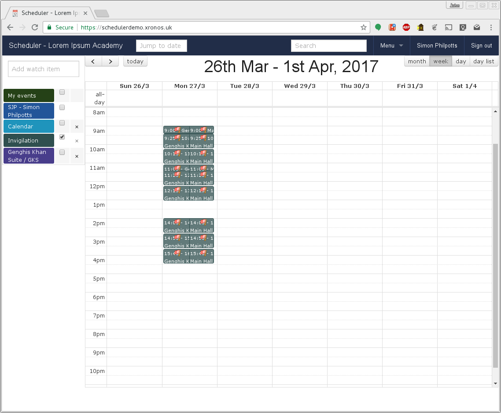

Note that there is a single event for each room and slot, and currently
they each have a red flag because they are short of invigilators.  These
flags are visible only to nominated exams officers - they don't appear
to normal users. By clicking on one of these events, you can start
allocating invigilators.

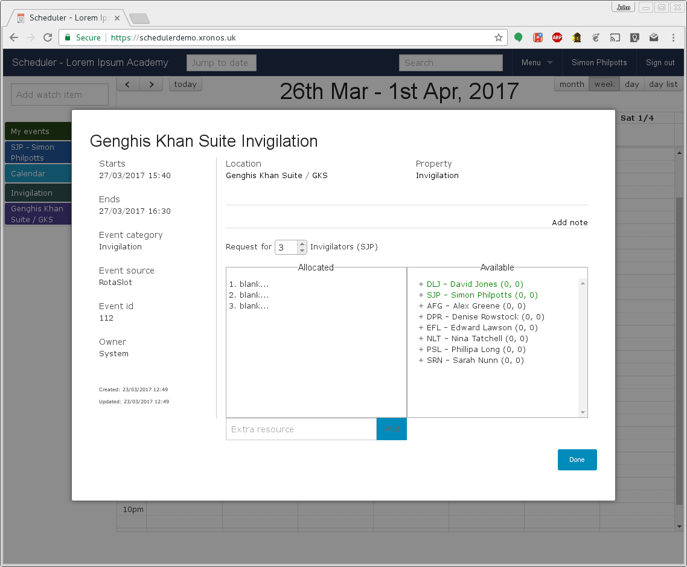

The event is currently set to expect the default of 3 invigilators and
none has been allocated.  The box on the right lists free staff (those
not currently teaching) and they have been sorted in order of
suitability.

The names in green are staff members who *would* otherwise have been
teaching at the time, and thus are first choice to do the invigilation.
The rest of the staff listed are those who are free, and the numbers
after their names show how many invigilations they have already been
scheduled for - the first number is for the current day, and the second
for the current week.  Currently no-one has any invigilations so they're
all 0.

To choose someone, simply click on the + next to the name and they will
move over into the "Allocated" box.  If, perhaps, only 2 people are needed
instead of 3 then you can nudge down the number expected.  Once the
number allocated matches the number expected, then the flag on that
particular event will go green.

Once a few slots have been filled, the staff listing gets more interesting.

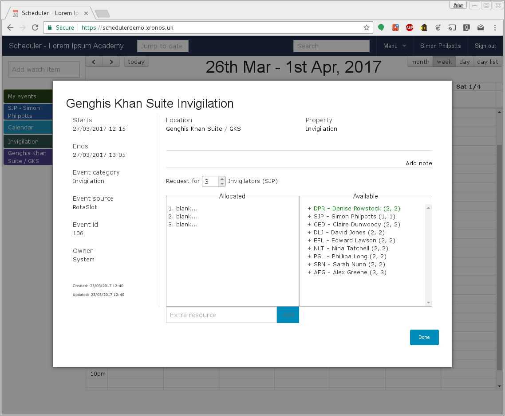

In this listing, we can see that Denise Rowstock might be the first
choice because she would otherwise have been teaching year 11, but
she's already been given 2 invigilation slots today.  Simon Philpotts
has done only 1, so he might be preferable.  (This demonstration school
has an unfeasibly small number of staff, which is why they are getting
so many slots each.)

.. note::

   It can happen that you want to allocate someone to an invigilation
   slot even though the relevant individual isn't actually free at the
   time.  For example, it might be a requirement to have the head of
   maths present at the start of a maths exam.

   The "Extra resource" box at the bottom of the list of allocated staff
   allows you to override the system's advice and add any member of staff
   as an invigilator for the current slot.

The final decision is as always best done by someone who knows the
school, but the program can help a lot in providing sorted lists.

.. hint::
   If you are going to allocate specific people to certain invigilation
   slots (.e.g the head of maths to start a maths exam) then do these
   allocations first, before you do the general
   just-need-four-people-who-are-free ones.  That way they can be
   taken into account when calculating the loading for the later
   allocations.

------------
Notification
------------

Once the invigilation slots have been allocated they will appear immediately
on the schedules of the individual members of staff.

They can also be printed out using the usual event reporting facilites,
and individual e-mail notifications can be sent.

To send out e-mails, choose Menu => Invigilation => E-mails and you'll get a
form like this.

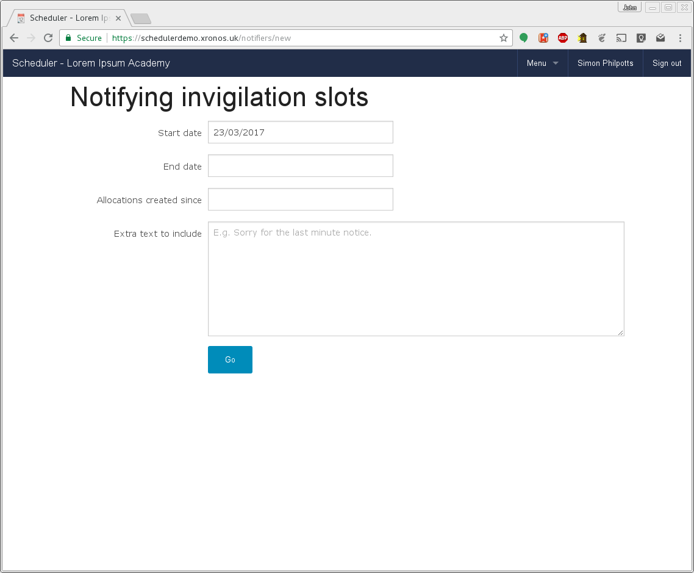

The start and end date indicate the period for which you want to
send out notifications, and the next field allows you to send out
notifications only for invigilation slots added *after* a specified
date - useful if you've been amending the allocations and want to
notify just the amendments.

Finally, you can add a bit of free-format text if there's any
extra message you want to put in.

Click on the "Go" button and you should see a screen much like this:

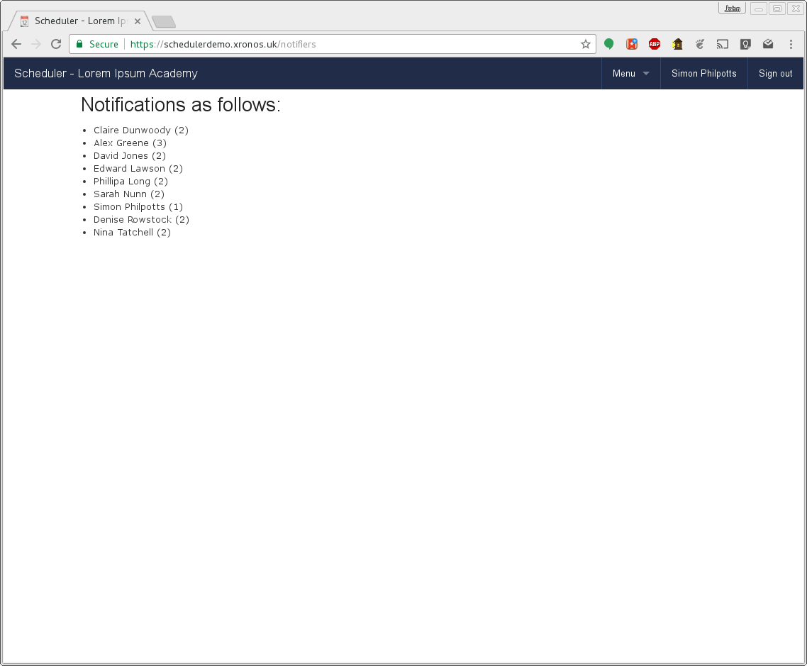

Your users will have been sent individual e-mails asking them to
cover their particular invigilation slots.

-------
Clashes
-------

You can also check for clashes affecting your invigilation allocations.
These can arise for two reasons:

* You've overridden the system's list of free staff to cover a slot
* Fresh events have been entered into the system after the staff were chosen.

To check for clashes, use Menu => Invigilation => Clashes and after
a short delay you'll get a list any potential clashes on your screen.
