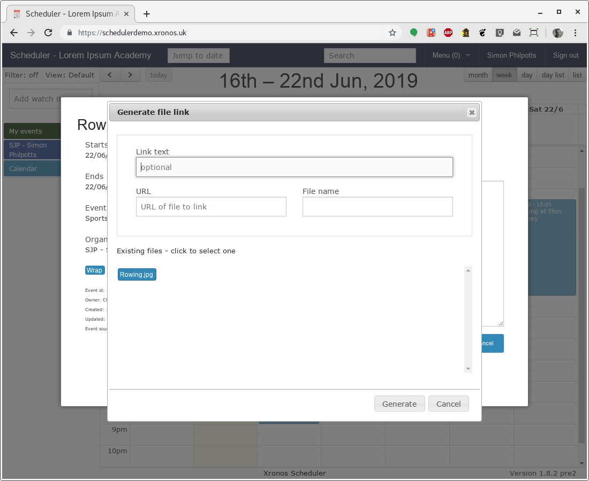
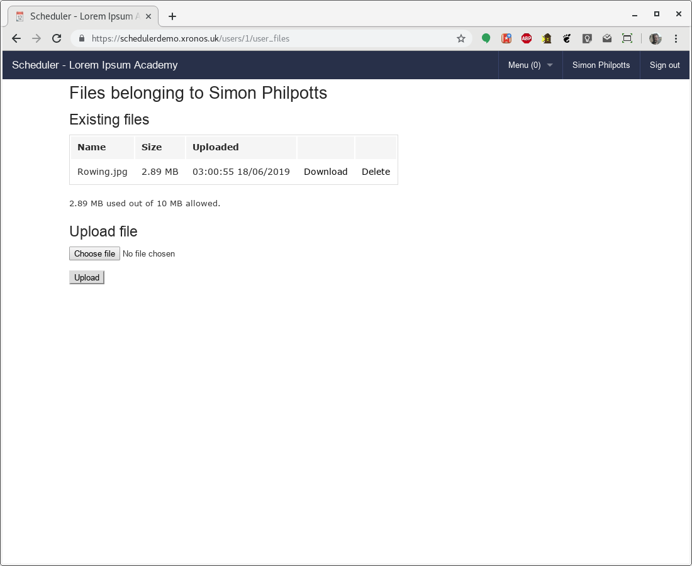

.. _notes_and_files:

Notes and Files
===============

Overview
--------

Any event within Scheduler can have notes and files attached to it
by suitably privileged users.  The author of a note can set its
visibility so that it can be seen by staff, pupils or the general
public, or any chosen combination of these.

.. note::

  By default, staff can add notes to events and pupils can't but
  the system adminstrator can change these permissions as requiured.
  They can be changed on a per-user basis, or by creating and editing
  User Profiles.

These notes can be used for a wide range of purposes.  For example:

- If a lesson is being covered the original teacher can leave a note
  specifying the cover work, which is then accessible to whoever ends
  up doing the cover. If necessary, worksheets can be attached as files.
- For a pupil activity, the organiser might leave a note visible to all
  the pupils describing preparation work needed.
- For a public event, a publicly visible note can be added with extra
  details of the event, a link to Google Maps for directions, and a
  downloadable programme.

A sample note can be seen on the
`Scheduler demonstration site <https://schedulerdemo.xronos.uk/>`_.  Just
click on the rowing event on the Saturday to see it.

This note includes a link to Google Maps, and a downloadable file.  The
initials at the bottom right (SJP) indicate that this note was added
by Simon Philpotts.

Markdown
--------

For a simple note, the user can type just text and not worry about
the formatting.  However, if more is required then all the facilities
of `Markdown <https://en.wikipedia.org/wiki/Markdown>`_ are at your disposal.
You can create headings, add formatting, embed links and much more.

Creating a note
---------------

Let's take a look at how SJP might have created that note.  Before he
added the note, his detailed view of the event (gained by clicking
on it) would have looked like this:

Note the "Add note / file" link towards the right of the dialogue box.
Clicking on that produces this view:

The basic text can be entered very easily.  In the next screen, SJP
has got as far as wanting to embed the link to Google Maps.

Note that the cursor is positioned where he wants the link to go.  He then
clicks on the "Link file" button (bottom left) to open the link helper
dialogue:

Here we have three fields:

- The first field is for the text of the link to be embedded.  In our
  case we want to put just "Google Maps".
- The second field is for the required URL.
- The third one is for a file name.  It's not needed in this case, but
  when using an actual file, it will be used as the text of the link
  if nothing is entered in the first field.

Filling in the fields as above and then clicking "Generate" will produce this
in the note being created.

The helper has simply formatted the data given into a Markdown link.

The note is intended to be read by the general public, so click the
"Guests" box under "Visible to", and then click "Save" to save the
work to date.  The note now looks like this:

.. note::

  You don't need to use the helper - it's easy enough to type a Markdown
  link manually - but it can make the job just a little easier, particularly
  if you want to embed a link to a file held on Scheduler itself.  Read on.

Next we want to embed a link to a picture file which has already
been uploaded to Scheduler.  We type the next bit of text, then again
invoke the "Link file" dialogue.

The text field has been filled with "early morning rowing", and then
the other two have been filled by clicking on the icon in the file
list below the fields.

And then clicking on "Generate" we get back to this.

Note that this time the embedded link points to a file hosted on
Scheduler itself.

Finally we can add the last line of text, and because we want it
in italics we surround it with underscore (_) characters.

And then once "Update" has been clicked the final note looks like this.

Because that second link points to a file actually hosted on Scheduler,
a separate link has been created on the right hand side.  Clicking
either within the text of the note, or on the link on the right hand
side will cause the file to be downloaded.

Uploading files
---------------

Assuming your system administrator has given you permission to upload
files to Scheduler, you can upload them from the main menu.

Use Menu => Files to get to your list of currently hosted files.

Note the list of existing files, plus a note of how much of the
user's available space is already in use.

To upload a file, click on "Choose file", select the file you want
from the resulting dialogue, then click on "Upload".

.. note::

  The appearance of the file selection dialogue will depend on what
  browser and operating system you are using.  Typically it will
  be the normal file selection dialogue for your system.
