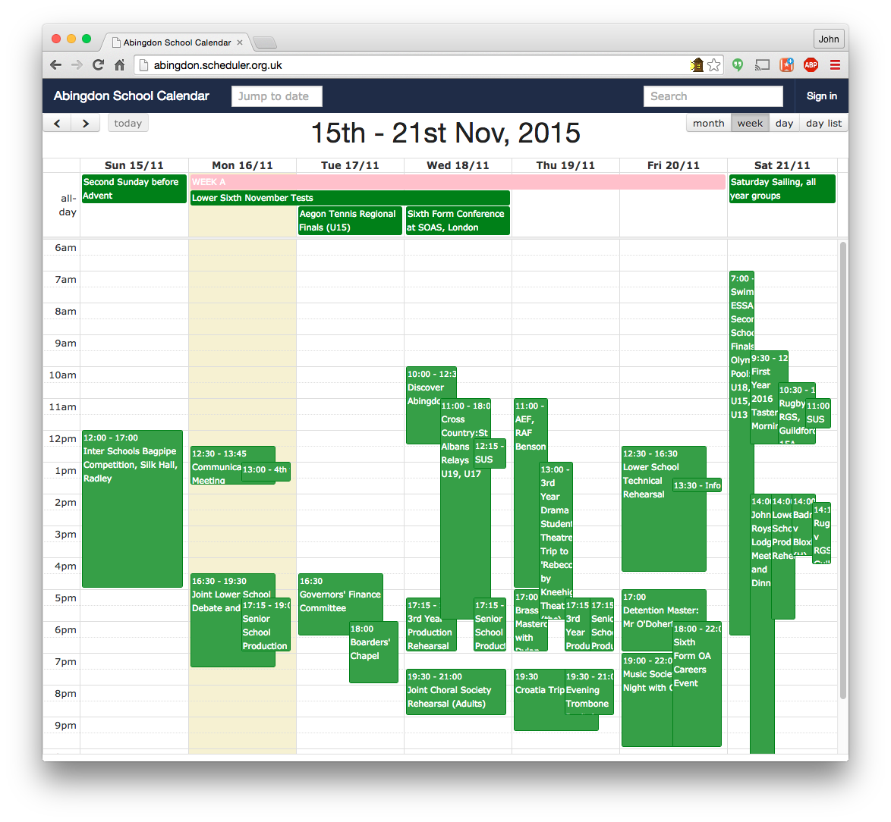
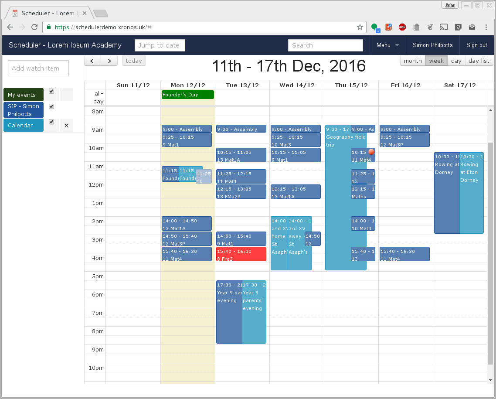

Introduction
============

or, "What is happening - where, when and with whom?"

---------
Overview
---------

Xronos Scheduler is a scheduling program designed primarily for use in
schools, but potentially of use elsewhere.

Think of it as being much
like any other calendar program, but with structure added.  Instead of
having lots of separate calendars it stores just one calendar - and keeps
track of who and what is involved in each event.  You can then view
any part of the calendar depending on what resources it involves.

The objective is to provide all the information which staff and pupils
need about what's happening in the school and when *all in one place*
and with the information already tailored to suit each individual user.
Usually all this information already exists within the school, but it's
spread around a dozen different sources.  Even information stored within
a single MIS can't usually be viewed all in one go - you look in one
place for your basic timetable, another for the prep timetable, another
for external events, etc.

It is then often necessary to work out how the information applies to
the individual.  For instance, working from the prep timetable for the
whole school, each member of staff and each pupil separately works out
which slots apply to him or her.  Similarly, for trips, each member of
staff has to work out which pupils will be missing from a lesson because
all the year 11 geography students are going on a field trip.  This kind of
work really should be done by a computer, and Scheduler does exactly
that.

Where pupils are scheduled to be missing from a lesson (for a trip,
or some other activity) the fact is flagged automatically to the teacher
and a list of the affected pupils is provided.

To the casual user, it at first looks much like any other calendaring
program, but the major difference is that instead of holding lots of
separate calendars it stores a single structured schedule for
the entire organisation. It then provides the means to pick and choose
what you see.  Casual browsers see only events which are flagged as
being public, but logged in users have far more control.

Scheduler is designed to import whatever schedule information is available
from your existing MIS - e.g. Timetable, Cover, Extra-Curricular activities -
but then it merges that with its own information, to produce a complete
schedule for any member of staff, pupil or location within the school.

Users can pick and choose what they see, check for free time, or
identify free resources at a given time (e.g. an unused ICT room).

Below is the initial view which would be seen by a fictional
teacher (Simon Philpotts) at a fictional school on first logging in.
You can pretend to be Simon Philpotts by using any Google account to
log in to the
`Scheduler demonstration site <https://schedulerdemo.xronos.uk/>`_.

Note the dark blue items (events involving Simon Philpotts directly,
mainly his timetable) the light blue items (public calendar events)
and one red item which is an instance of cover.  Once logged in he
can choose to see these or not, plus choose to add any other member
of staff or pupil's timetable and much more.

