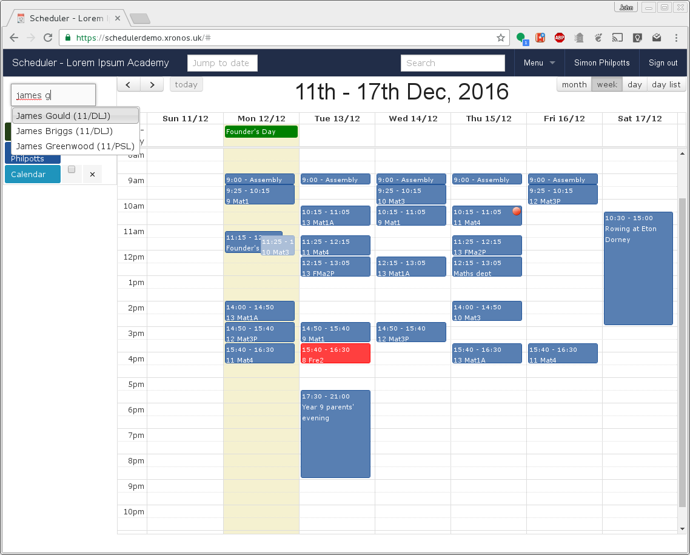
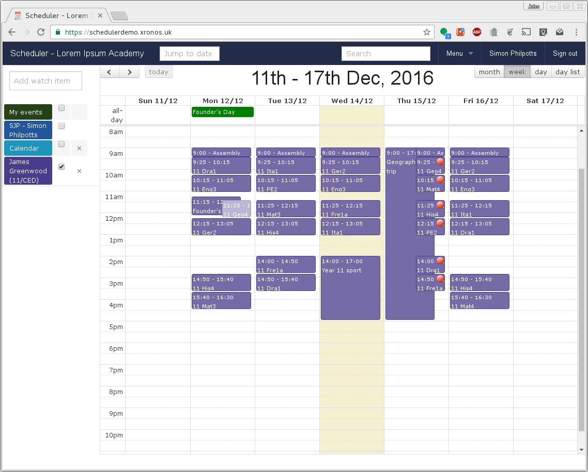

Quick tour
==============

.. note::

   You can work through this tour for yourself by accessing the
   `Scheduler demonstration site <https://schedulerdemo.xronos.uk/>`_.
   Log in with any Google account and you will be treated as a fictional
   teacher - Simon Philpotts.

   Although your Google user name will be stored for the purposes of
   logging you in, the whole database is reset every night and it will
   then be deleted.  It will not be used for any other purpose.

   The demonstration contains just one week's worth of data (always
   the current week) for a fictional school.  It's far from being
   a complete set of data, but enough to see how it works.

===========
Public view
===========

When you first access Scheduler you will see a page much like this:

.. image:: public.png
   :scale: 75%
   :align: center

It is showing the school's public calendar, which is available
for anyone to view. Note the buttons at top left for moving forwards or
backwards by a week, and the buttons top right where you can change to a
Month, Week or Day view.

You can click on any event to get more information about it (like who is
organising it), or you can use the two boxes in the top bar to jump to a
specific date, or to do a textual search for a particular event.
The text search is reasonably intelligent, so if you search for,
for instance "u16 rugby", it will find any event which mentions both
"u16" and "rugby" in any order. It is not case sensitive.

=========
Logged in
=========

If you log in, you can do much more. Click on the "Sign in" button at
the top right of the screen, and sign in using any Gmail account.  (In
a real installation, the account would have to be one allocated by the
relevant school, but for this demonstration system any one will do.)

You should then see a screen much more like this:

.. image:: loggedin.png
   :scale: 75%
   :align: center

The demonstration system treats you as being a fictional maths teacher -
Simon Philpotts.  You will find you have full edit privileges to create
events within the system, although for obvious reasons you can't edit your
own timetable, or events created by other people.

Note the left hand column, where you can select the resources for which
you want to view events.  By default, when you first log in you are shown
your events (that is, ones which you have created), events in which you
are involved, and the public calendar.  Some events (e.g. the rowing event
on Saturday) are appearing more than once.  This is because they meet
the selection criteria more than once.

To tidy up the display, un-tick the check boxes against "My events" and
"Calendar" in the left-hand column.

The system is now showing just Simon Philpotts's schedule, with one extra
item creeping in.  At the top of Monday's column there is an entry for
"Founder's Day".  This is an event in a break-through category which will
always show through.  Entering such events requires special privileges within
the system.  They are typically used for things like the start and end
of term.

Apart from that, everything else now on the display is an event involving
Simon Philpotts.  Mostly these are his lessons, but there are a few interesting
extra features.

============
Cover lesson
============

In period 7 on Tuesday, there is an entry in red.  This is because it is
a cover lesson - not part of SJP's normal schedule.  To gain more information
about this entry, click on it.

Similar details can be viewed for any event, but there are some extra
bits here.  It says that SJP is covering for CED, and if you don't know
who CED is then you can hover your mouse over the initials to get that
information.

Claire has also attached a note to the lesson giving details of the required
cover.  This particular note is visible only to staff, but the creator of
a note can choose to make it visible to pupils and/or the general public
as well.

To get rid of the pop-up, press Escape, click on the Done button, or just
click anywhere else in the window.

Note that the display for SJP contains more than just his timetable - it
can show all the events in which he is involved.  On Tuesday evening there
is the Year 9 parents' evening (which will appear automatically on the
schedules of all those who teach year 9) and on Saturday there is a rowing
event in which SJP is involved.

======================
Other things happening
======================

Two more things are worth noting here.

As Monday is Founder's day, there is a special Founder's Assembly at 11:15.
This means that normal lessons will not happen then, and so SJP's normal
lesson at that time with 10 Mat3 has been greyed out.  The system can
do this automatically for the whole school, or just for selected year groups.

On Thursday, one of SJP's lessons has a red dot on it.  Again, this has
been added automatically by the system and it indicates that some of the
pupils seem to have a clashing commitment.  Click on that lesson for
more information.

A note has been added by the system listing the pupils who seem to be
doing something else at the time.  5 pupils are going to be missing out
of a set of 25, so that may well affect SJP's lesson planning.

If you look back at the earlier screenshot including the school's public
calendar you can see the Geography Field Trip listed there.  It might
however be interesting to know more about what is going on.  Here you can
start to see the real power of Scheduler.

=======================
Viewing other schedules
=======================

James Greenwood is listed as being involved in this outing, so close the
pop-up and start typing his name in the "Add watch item" box at the top
of the left-hand column.

Either keep typing his name, or select his name from the list which
pops up, and James's schedule too will be added to the display.  To
avoid it getting too cluttered, un-tick the checkbox against SJP's name.

You can now see James's full schedule, including the Geography Field Trip.
Note that his period 3 lesson on Monday has also been suspended for the
Founder's Assembly, and all his lessons on Thursday have notes against
them.  You can see these notes only because you're viewing as a member
of staff - pupils can log on and see their own schedules, but they don't
see these notes, nor any others unless they have been specifically flagged
as being for pupils.

An important point to note is that none of the events shown for James
Greenwood explicitly lists him as being involved.  Instead they involve
groups, and then James is a member of the relevant groups.  The system
creates each pupil's schedule on the fly by looking at the groups of
which he or she is a member, and then finding the relevant events.  If
a pupil changes set in the middle of a week then the schedule will reflect
this, showing lessons in one set at the start of the week, and lessons
in the other at the end.

Look closely at James Greenwood's maths lessons on Monday, Tuesday,
Thursday and Friday.  On Monday and Tuesday he is in 11 Mat3 
with David Jones in L102.  On Thursday and Friday he is in 11 Mat4
with Simon Philpotts in L101.  (Click on the individual
event entries to get this level of detail.)  The system knows that
James changed maths sets mid week, and the display of his schedule
reflects this.

Scheduler understands that the population of groups - particularly
teaching sets - changes over time.  It doesn't store just a list of members
but full details of the group's population at any given moment in its
history.  Schedules will always be displayed taking into account the
correct membership for each group on the specific day when an event
is happening.

As well as pupils, you can view the schedule of any other member of staff
(try Claire Dunwoody - the French teacher for whom SJP is doing a cover)
or any room or other resource.

=======
Summary
=======

Scheduler merges information from your MIS and other sources to give
a single unified view of all that is going on.  On the timetable front
it shows not what *would* be happing in a typical week, but what *is*
happening this week.

Try clicking on any of the watched resources in the left-hand column to
tweak your display, or on your user name in the top bar to adjust your
options.  At any time you can get straight back to the schedule display by
clicking on "Scheduler" at the top left of the screen.

There is much more that you can do, but this is probably enough for a
quick tour.

