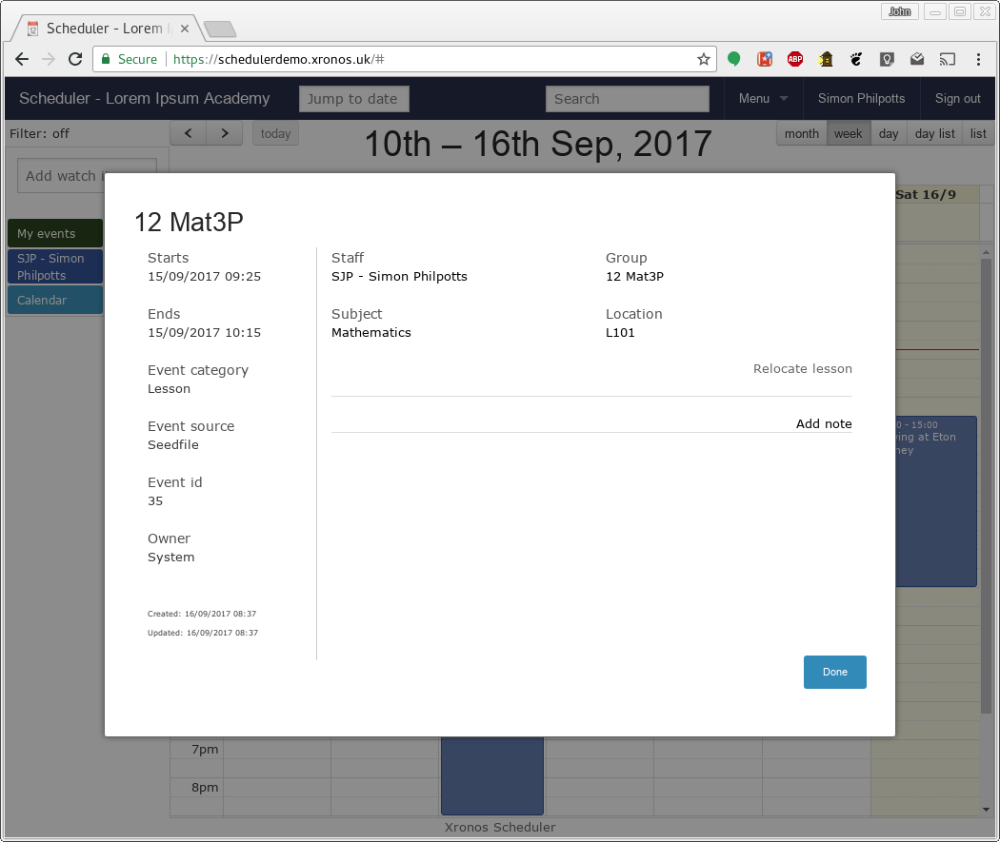
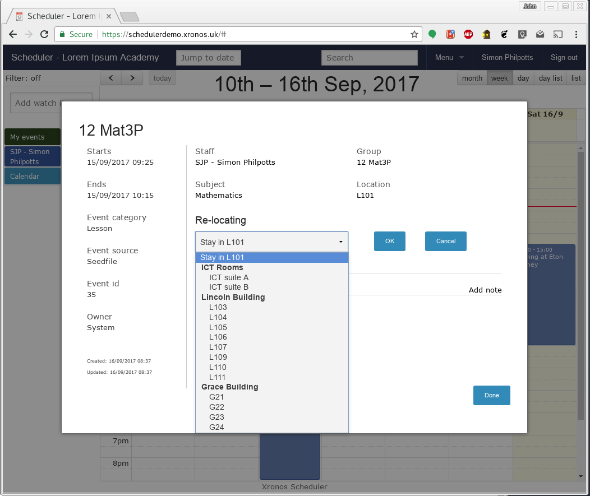
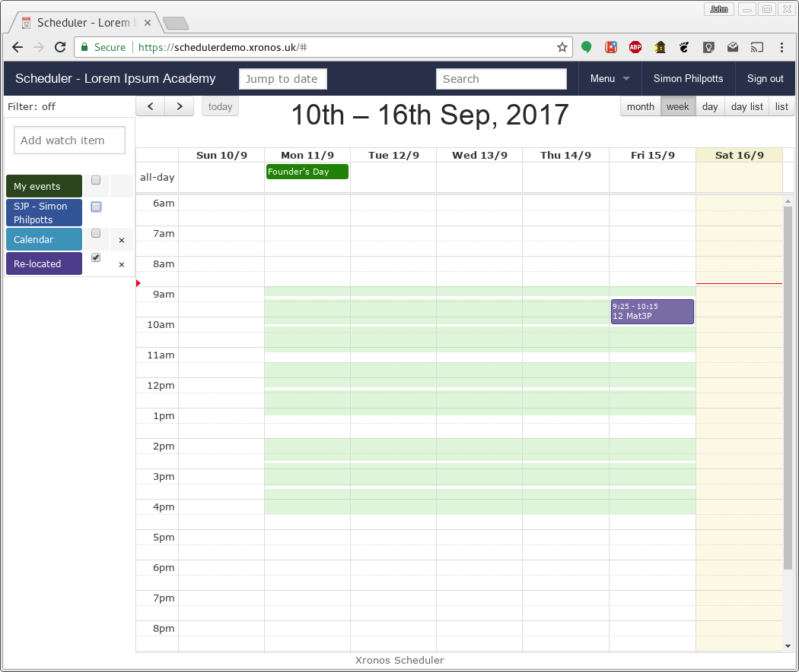

Re-locating a lesson
====================

.. note::

   This functionality relates to moving just one instance of a lesson
   to a different location.  If you want to change all the instances
   of a lesson then it should probably be done through your MIS in the
   usual way.

There are various reasons why it might be desirable to move a single
instance of a timetabled lesson to a different room.  The teacher of
the lesson might want to move it to a specialized room (e.g. an ICT suite),
or it might be necessary to move all the lessons out of a given room
to allow for something else to happen.

Permissions to re-locate lessons are controlled by your system administrator,
but in general individual teachers can re-locate their own lessons, whilst
certain nominated users can re-locate any lesson.

To re-locate a particular lesson, simply click on the lesson in the
calendar view.  The usual event details dialogue will be displayed, and
if you have permission to re-locate the lesson then a link will be
there - "Relocate lesson".

Click on the link and a new pop-down entry box will appear, which after
a very short delay will be populated with a list of available rooms.

.. note::

   The rooms available here are configured by your system adminstrator.
   You will usually find that they are grouped by building or function
   (or both).

The system automatically shows you only rooms which are free at the
required time.  Click on the one which you want and then click on OK
to re-locate your lesson.

.. image:: relocate3.png
   :width: 600px
   :align: center

To move a lesson back to its original location, use the same dialogue and
choose the first entry in the list.

Once a lesson has been re-located in this way, it acquires the "Re-located"
property, and so all re-located lessons can be viewed at once using the
usual event selection tools.

