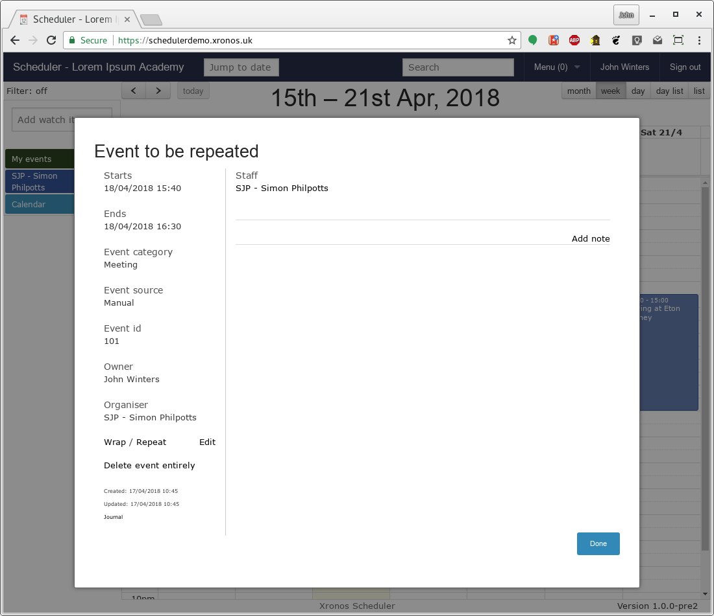
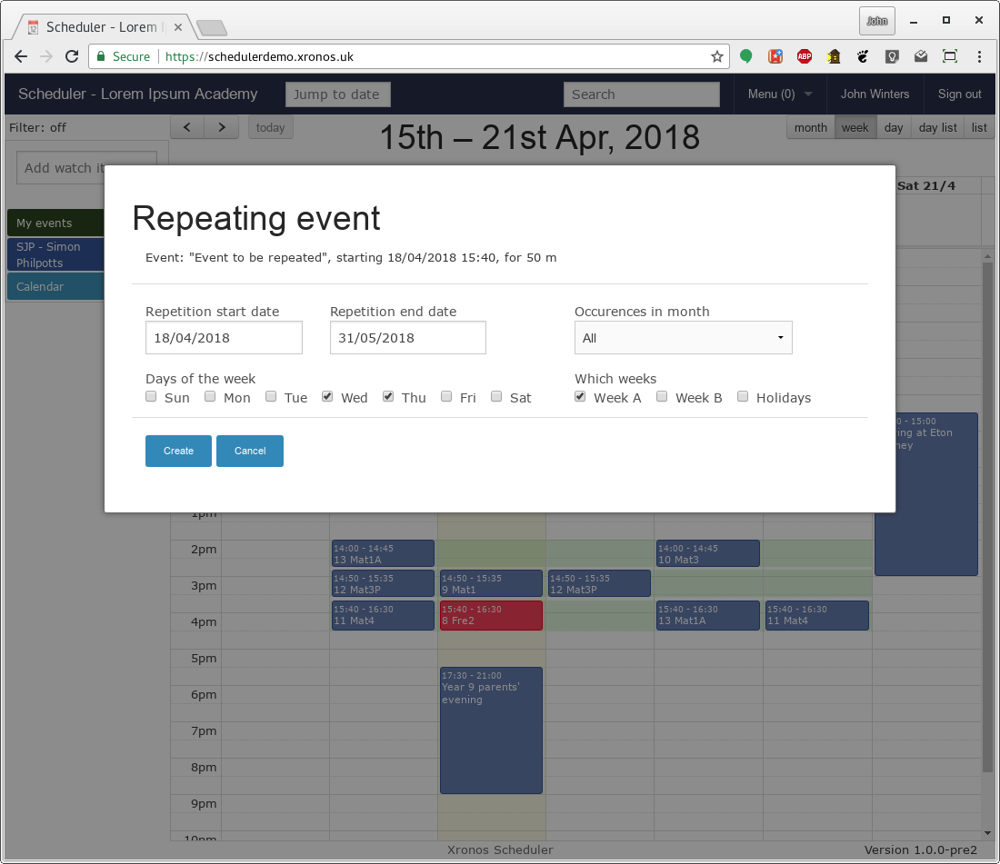
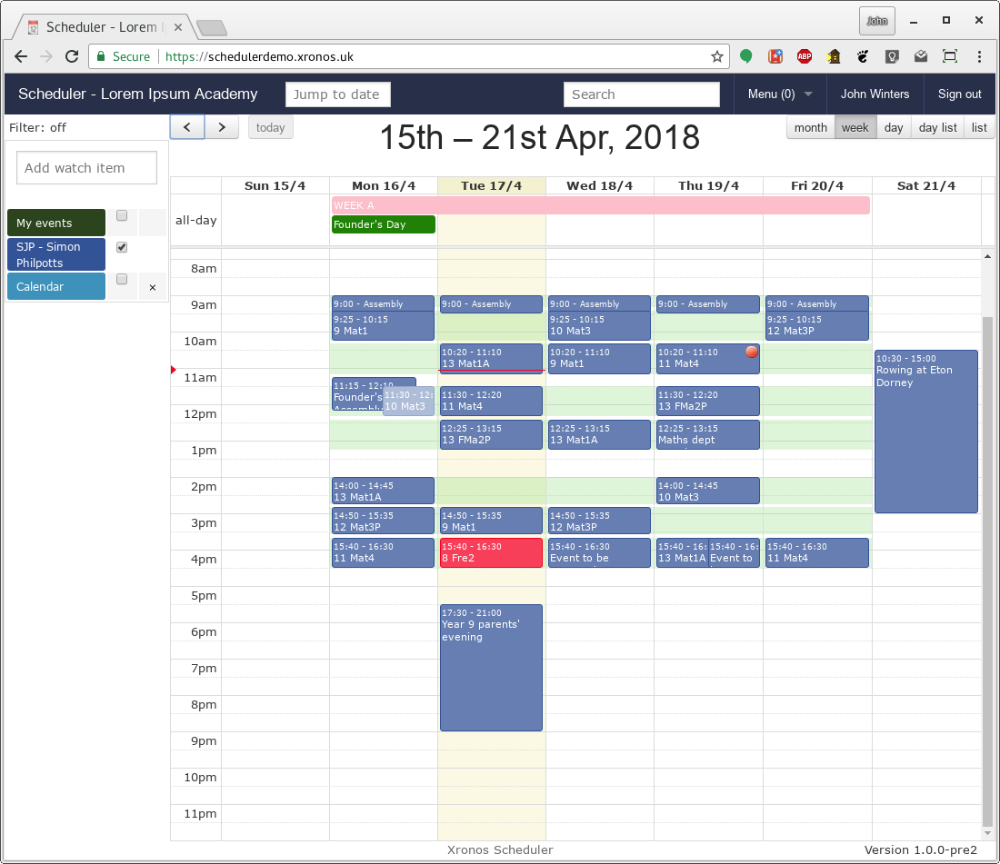

Repeating events
================

--------
Concepts
--------

Once you have entered an event into Scheduler, you can cause it
to be repeated through the academic year.

You can specify:

- Start date
- End date
- Days of the week (Monday, Tuesday, etc)
- Which weeks (Week A, Week B, Holidays)
- When in a month (first Monday, third Tuesday, etc.)

Any resources attached to your original event will be attached to
all the copies as well.  Your original event functions as a kind
of prototype to create all the others.

When you repeat an event like this, each instance is an event in
its own right, but the whole set are joined together under an
umbrella record.  You can still edit the events individually,
but you can also use any of them to repeat the repetition process,
bringing them all back into line.

------------
Restrictions
------------

Events which have been imported from your MIS or other external
sources are excluded from the repetition facility.  Typically
these are things like lessons and meetings, and if they are
due to repeat then that should already have been taken care of
before they were imported.

Likewise, if an event lasts for more than one calendar day you
can't use it as a prototype for repetition - it doesn't make sense
to say "Repeat on Tuesday of Week B" if the event itself is longer
than a day.

You can only repeat events to which have you some degree of edit
access - specifically those where you have sub-edit permission.
You thus can't set up a repetion for arbitrary events set up by
other users (unless you are a privileged user with extra edit
permissions).

The repetition facility is meant to be used within the context
of a school's academic year.  If you try to go beyond that, you may
well find that week letters for instance (which are used to select
which weeks to repeat into) have not been defined yet.  The
repetition code will prevent you trying to enter events over a
period of more than a year.

--------
Creating
--------

Once you've created your original event (see 
:ref:`entering_events`) you will find you have an extra link called
"Repeat" available on the left-hand side of the "Show event" dialogue.

Clicking on this link will replace the dialogue with one allowing you
to specify your repetition criteria.

Here you can specify a start and end date for your repetition, which
days of the week the event is to happen, which weeks, and when in the
month.

.. warning::

   The conditions you specify here are applied cumulatively.
   All of them must be met for your event to be created on any
   particular day.  If you specify an occurence in the month
   (e.g. First, Second, Third) and also specific week letters
   then your event might not happen in certain months.

   E.g. if you specify the first Thursday of a month, and you
   specify week A only, then the first Thursday might not be in
   week A, and so your event won't happen in that month.

   These two conditions are really intended to be used separately -
   either specify which weeks you want, or specify when in the month
   you want - not both.

In the following image, the event has been specified as happening on
Wednesday and Thursday of Week A only until the end of May.

Clicking the "Create" button will cause the requested events to
be created, and after a short delay they will appear in the
main calendar screen.

.. note::

   It's quite possible to create repetition criteria which do not
   include the original event.
   
   For instance, you could create an
   event on a Tuesday and then specify you wanted it to occur on
   every Wednesday and Thursday of week B.  If you do that, then
   the original prototype event will be deleted as part of the
   propagation process.
   
   You will still be able to edit your repeating set by way of
   any of the other events in the set.

--------
Amending
--------

Should you decide you want to amend a repeating event later, you
have a couple of choices.  You can amend just one instance of the
repeating event and leave it like that, or you can choose to
propagate your change to all the other events in the repeating set.

To change one event, just edit it in the usual way.

To propagate your change, click on the "Repeat" link again, and
then on the "Update" button.

--------
Deleting
--------

To delete a single event from a repeating set, just delete it
in the usual way.

To delete the whole set, click on the "Repeat" link, and then on
the "Delete" button.
