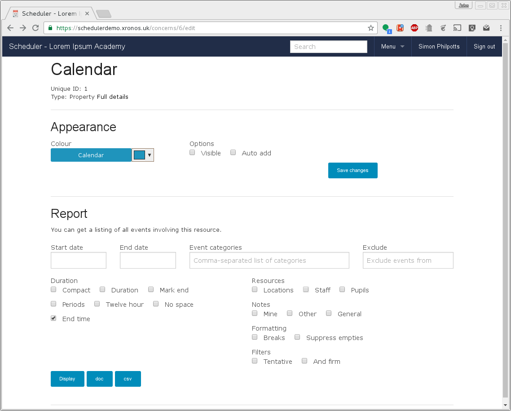
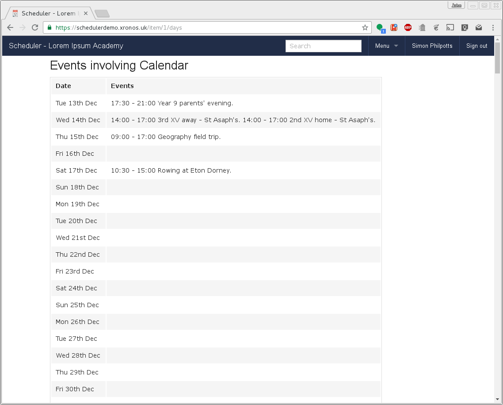
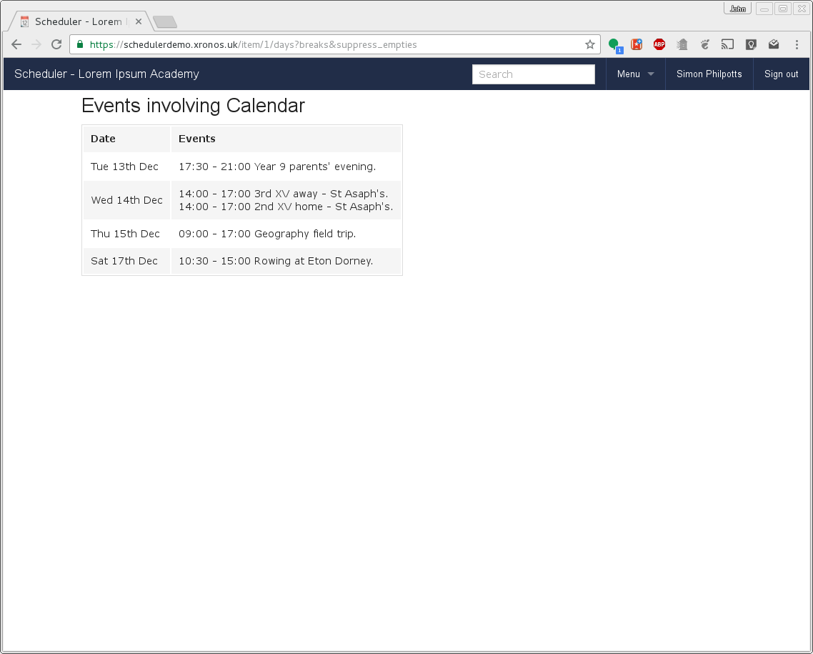

.. _creating_reports:

Creating reports
================

Scheduler can generate a report for you on any of the resources which
it knows about - a person, a pupil, a classroom or property. The report
will list all the events scheduled for that item over whatever period
of time you choose.

Broadly speaking there are two ways to create reports - you can put your
requirements into a form, or you can construct a custom URL. The former
way is much easier, but you can do just a tiny bit more using the latter
way.

Note that the form constructs the URL for you, so you can always start by
using the form, then tweak it (or create a bookmark) to get exactly what
you want.

--------------
Using the form
--------------

To use the form, start by watching the item for which you want a report.
See "Quick tour" for details of how to pick what you're watching.
Then click on the coloured box for your chosen item in the left hand
column. That will give you a screen like this - I've chosen to work with
the school's public calendar.

You'll notice that on this same page you can also customize the appearance
for this resource, but the bit that we're interested in here is the report.
This will generate for you a list of events for the selected resource.
If you immediately go on and click "Generate" you'll get something like
this:

This is the simplest form of the report - it starts at today, and goes as
far into the future as there are events. Using the form you can specify
your own start and end dates, and restrict the events to a list of
categories which you choose. (See Reference for a list of the categories.)
You can even specify another event property and exclude events with that
property from your listing. This can be handy if you want a listing of all
events for a given resource which, for instance, *aren't* in the public
calendar.

There are also quite a few flags available to tweak the output.
It's noticeable in the listing above that multiple events squeeze onto
a single line, and there are days with no events at all. I can use the
back button to return to the form, then select "Breaks" to add line breaks
between events, and "Suppress empties" to remove empty days from the
listing and it then looks like this:

For further explanation of what each of the tick boxes does, hover your
mouse pointer over it and you will see some explanatory text.

After you've run a report, the system will remember the options which you
chose, and will present them as defaults the next time you try to generate
a report for the same resource.

As always, to get back to the normal calendar display, click on the
"Scheduler" button at the top left of your screen.

----------
Custom URL
----------

Those of a technical bent will have noticed that when you use the form
above to generate a report, it actually constructs a custom URL using
all the options which you have chosen from the form.

The URL for the last report shown above is:

  https://schedulerdemo.xronos.uk/item/1/days?breaks&suppress_empties

This can be useful if you want to save a direct link to a report
for later use.

This section documents all the different options which may appear in
such a URL, but you are strongly recommended to use the form to
automate the construction.

The base URL for generating a report is:

https://schedulerdemo.xronos.uk/item/&lt;number&gt;/days

To find out the relevant number for the item which you want, simply hover
over one of the coloured boxes on the left hand side of the screen.
As an example, the calendar's unique number is 1, so if I wanted
a report on calendar entries I would use:

  https://schedulerdemo.xronos.uk/item/1/days
  
which will generate a report on all the current entries in the calendar,
looking like this:
The events are sorted into their days and appear in chronological order,
from today's date until as far in the future as the events go.
Should you want to download the report, add either ".csv" or ".doc" to the
end of the URL to get either a CSV file (suitable for a spreadsheet) or
a DOC file (suitable for a word processor).

  https://schedulerdemo.xronos.uk/item/1/days.csv
  
You can then tweak the report using the following available switches:

.. csv-table:: Report switches
   :header: "Switch", "Meaning"
   :widths: 10, 40

   compact, "Hello there - I'm a meaning"
   duration, "This one too has a meaning, of sorts."

+-------------------+-------------------------------------+
| Switch            | Meaning                             |
+===================+=====================================+
| compact           | Hello there - I'm a meaning         |
+-------------------+-------------------------------------+
| duration          | And here's another.                 |
+-------------------+-------------------------------------+

========  =======================================
Switch     Meaning
========  =======================================
compact   What happens if my words go on too far?

          Can I have more than one line of text

          associated with the same bit on the left?
duration  And this one does too.
========  =======================================

.. list-table:: Report switches
   :widths: 60 220
   :header-rows: 1

   * - Switch
     - Meaning
   * - compact
     - words of explanation
   * - duration
     - words of explanation.  In fact, quite a lot of explanation.
       More than enough to fill the full width of the box and then
       wrap onto a following line.  Will it mess up and squeeze the
       left hand column?

       A fresh paragraph.
   * - mark_end
     - words of explanation
   * - locations
     - words of explanation
   * - staff
     - words of explanation
   * - pupils
     - words of explanation
   * - periods
     - words of explanation
   * - start_date=
     - words of explanation
   * - end_date=
     - words of explanation
   * - twelve_hour
     - words of explanation
   * - no_end_time
     - words of explanation
   * - breaks
     - words of explanation
   * - suppress_empties
     - words of explanation
   * - tentative
     - words of explanation
   * - firm
     - words of explanation
   * - categories=
     - words of explanation

* compact
* duration
* mark_end
* locations
* staff
* pupils
* periods
* start_date=
* end_date=
* twelve_hour
* no_end_time
* breaks
* suppress_empties
* tentative
* firm
* categories=

Note that if you've used the ".csv" or ".doc" extensions, then the switches
go *after* the extension, like this:

  https://schedulerdemo.xronos.uk/item/1/days.csv?compact
  
Details of the switches are as follows:

compact

This switch reduces an event which spans multiple days to a single entry
on its first day. Thus, for instance, a sports trip lasting from 5th Dec
to 10th Dec would by default be listed on all 6 of these days. If this
option is specified then it will appear only on the 5th.

duration

For use with the "compact" option above. This causes the end date to be
included in the single starting entry. Thus for the same sports trip,
the entry on the 5th would now read "Sports trip (to 10th Dec)".

mark_end

Again for use in conjunction with the "compact" option. This switch will
cause the end day to get an entry as well. If it is added, the trip would
also appear on the 10th Dec as "Sports trip - ends"

locations

If specified, the (short) names of any relevant locations will be
included with each event.

staff

If specified, the initials of any staff involved will be listed with
the event.

pupils

If specified, the names of any pupils involved in the events will
be listed.

periods

If specified, the report will try to identify events which exactly
line up with period times, and will then identify the event by period
number, rather than by start and finish time. Only really useful for
reports on stuff which fits the timetable.

start_date=

List events starting on the given date rather than starting from today.

end_date=

List events up to the indicated end date, rather than going on forever.

twelve_hour

Show event times using the twelve hour clock (am/pm) instead of the
default 24 hour clock.

no_end_time

Don't show the end time for events - just the start time.

breaks

Put each event on a line of its own, rather than in a solid block.

suppress_empties

If any date has no events at all, don't produce an entry for that date.
Useful if the events being reported on are spread sparsely through the
calendar.

tentative / firm

By default, the report will contain only events to which the resource
is firmly committed. If someone has for instance, requested a calendar
entry but it hasn't been approved yet, then the event will not be listed
for the calendar. By adding the tentative flag, you can list tentative
events instead, and by also adding the firm flag, you can get both
tentative and firm commitments.

categories=

Provide a comma-separated list of categories to which to restrict the
selection.

So a URL like this: https://schedulerdemo.xronos.uk/item/1/days?twelve_hour&compact&duration&breaks&no_end_time

would produce output like this:

Look familiar?
