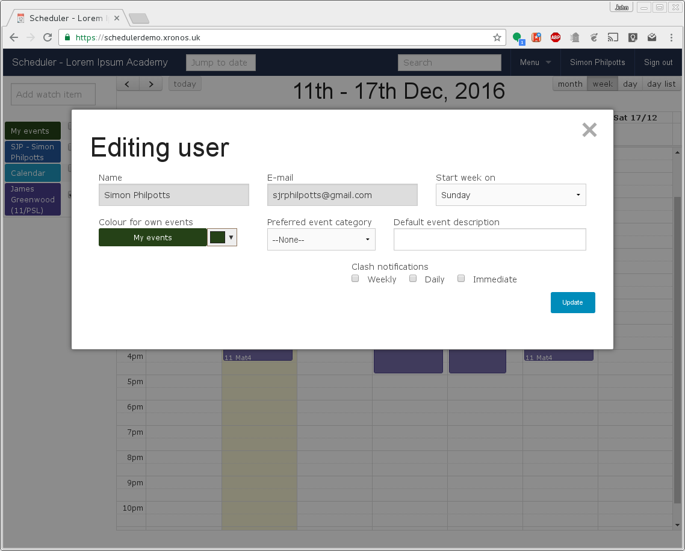
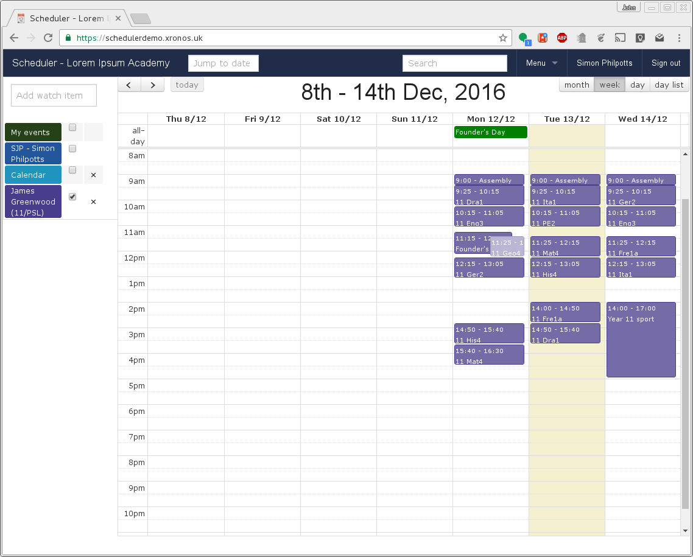
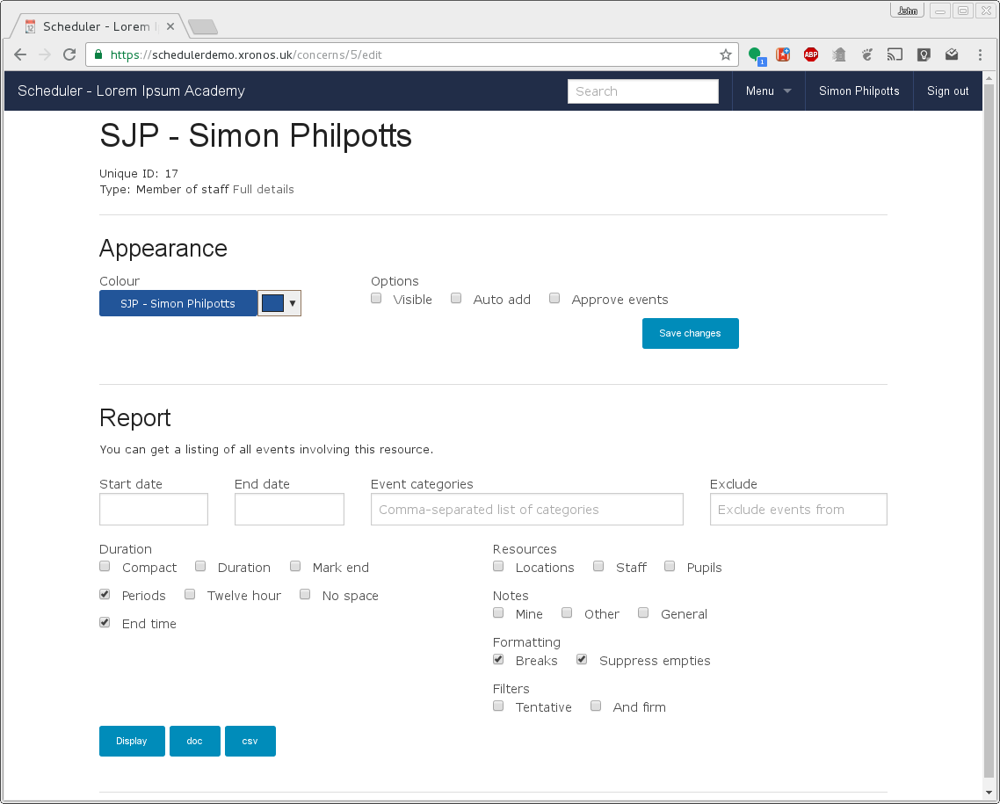

Tweaking things
===============

There are a couple of areas where you can tweak Scheduler to suit your own
particular working style. Firstly, you can click on your name at the top on
the right to change some of your user settings.

Here you can change the day of the week on which your week display will
start. By default it starts on Sunday, but some people prefer the week
to start on Monday. You can even set it start on Thursday if you like.

The other two fields allow you to set a default event category, and default
event description to be used when you create new events. If you're creating
a lot of similar events then this can save time.

There is a subtle distinction in Scheduler between your user record and
your staff record. Not all users are necessarily members of staff.
There are also things you can tweak on your staff record, and to do this,
click on your name on the left hand side of the screen.

That will produce a screen like this:

Here I can change the colour in which my events appear and whether or not
they are currently visible (the same as the tick box next to my name on
the main display).

If I tick the "Auto add" box, then any new events which I create will
automatically have me added to them. You can do this for *any* resource
which you're looking at - not just yourself. Thus if you need to make a
lot of events for one particular football team, you can set that team to
auto-add to each new event.

Finally, you can tick "Approve events" if you want to be notified by e-mail
each time someone adds you to an event. This is a bit like invitations in
Google Calendar. You can then accept or decline each invitation as they
come in. Alas, some events circumvent this process - it won't give you the
power to decline parts of your timetable, or requests to do cover.

For more information about the Reports section of this page,
see
:ref:`creating_reports`

